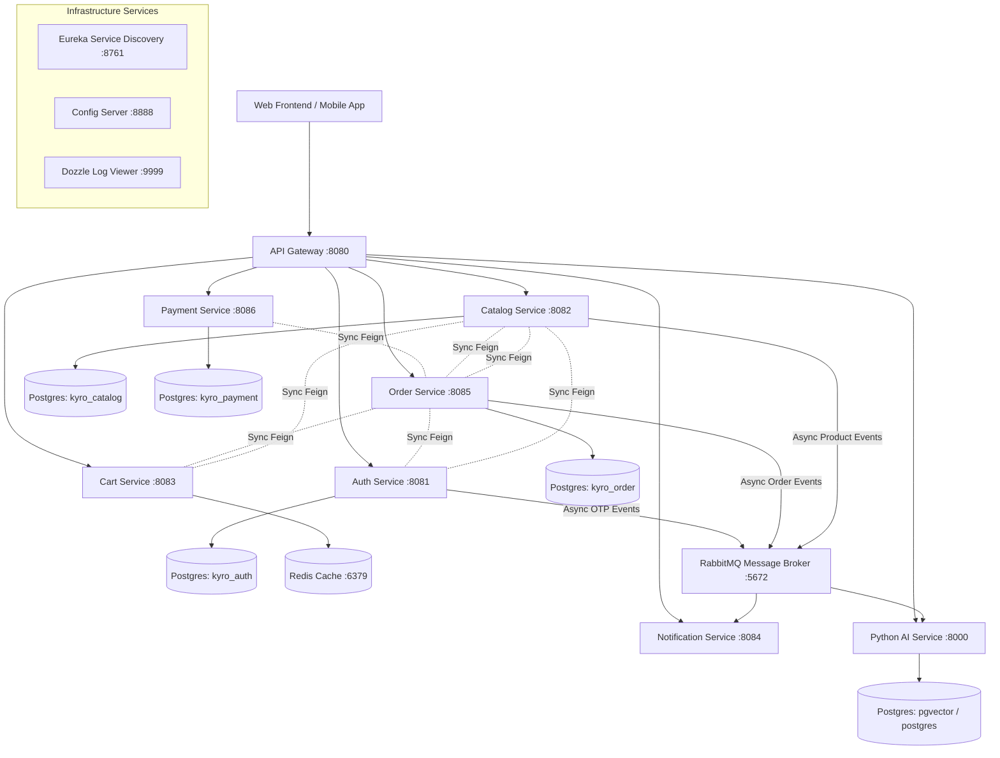
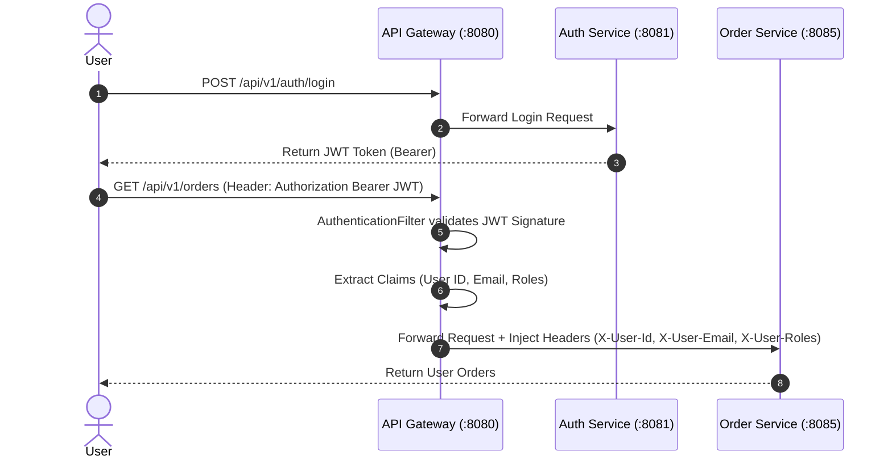

# 🛒 Kyro E-Commerce Microservices Backend Platform


Hệ thống Backend Microservices cho nền tảng Thương mại Điện tử **Kyro**, được thiết kế theo kiến trúc hướng dịch vụ (Service-Oriented Architecture), hỗ trợ xác thực tập trung, thanh toán VNPay, lưu trữ Redis, truyền nhận sự kiện bất đồng bộ qua RabbitMQ, và tích hợp AI Vector Recommendation.

---

## 📐 Báo Cáo Đánh Giá Kiến Trúc (Architecture & Clean Architecture Review)

> [!IMPORTANT]
> **Dành cho kỹ sư & nhà phát triển**: Vui lòng tham khảo file tài liệu chuyên sâu [**MICROSERVICE_ARCHITECTURE_REVIEW.md**](MICROSERVICE_ARCHITECTURE_REVIEW.md) để xem phân tích cặn kẽ về:
> - Phân tích mức độ tuân thủ **Clean Architecture / Hexagonal Architecture**.
> - Đánh giá cơ hội tận dụng tính năng **Java 21 (Virtual Threads / Project Loom)**.
> - Phân tích các **Anti-patterns (Lỗi giao dịch phân tán Dual Write)** và hướng xử lý **Saga Pattern**.
> - **Lộ trình Refactoring từng bước (Step-by-Step Actionable Roadmap)**.

---

## 🏛️ 1. Kiến Trúc Hệ Thống (System Architecture Map)



---

## 🛠️ 2. Danh Sách Các Microservices

Hệ thống bao gồm **11 Dịch Vụ & Hạ Tầng** phối hợp hoạt động trong mạng nội bộ Docker:

| Tên Dịch Vụ | Cổng (Port) | Vai Trò & Nhiệm Vụ Kỹ Thuật | Cơ Sở Dữ Liệu / Storage |
| :--- | :---: | :--- | :--- |
| **api-gateway** | `8080` | Lọc JWT Token (`AuthenticationFilter`), định tuyến HTTP, giải mã header (`X-User-Id`), cấu hình CORS tập trung. | *N/A* |
| **auth-service** | `8081` | Quản lý tài khoản, mã hóa Password BCRYPT, OAuth2 (Google & GitHub), sinh mã OTP (gửi sự kiện qua RabbitMQ), quản lý địa chỉ. | PostgreSQL (`kyro_auth`) |
| **catalog-service** | `8082` | Quản lý danh mục sản phẩm, biến thể (Size/Stock), đánh giá (Reviews), upload ảnh Cloudinary, phát sự kiện sản phẩm (`product.events`) qua RabbitMQ. | PostgreSQL (`kyro_catalog`) |
| **cart-service** | `8083` | Quản lý giỏ hàng tạm thời của người dùng với thời gian sống (TTL 30 ngày), gọi Catalog Client kiểm tra tồn kho. | Redis (`kyro-redis:6379`) |
| **notification-service**| `8084` | Consumer bất đồng bộ lắng nghe RabbitMQ queues gửi Email OTP và Mail xác nhận đơn hàng qua SMTP. | *N/A* |
| **order-service** | `8085` | Xử lý quy trình đặt hàng, tính toán chiết khấu, quản lý vòng đời đơn hàng (Pending -> Confirmed -> Delivered), phát sự kiện Order qua RabbitMQ. | PostgreSQL (`kyro_order`) |
| **payment-service** | `8086` | Tích hợp cổng thanh toán trực tuyến **VNPay**, tạo URL thanh toán & xử lý IPN Callback. | PostgreSQL (`kyro_payment`) |
| **ai-service** | `8000` | Dịch vụ Python FastAPI tích hợp Gemini AI và pgvector, lắng nghe sự kiện sản phẩm từ RabbitMQ để cập nhật index tư vấn & gợi ý sản phẩm. | PostgreSQL (`pgvector`) |
| **eureka-server** | `8761` | Service Registry đăng ký và phát hiện dịch vụ động cho Spring Cloud Feign Clients. | *In-Memory* |
| **config-server** | `8888` | Quản lý cấu hình tập trung từ thư mục `resources/config` cho toàn bộ microservices Java. | *Local Repository* |
| **dozzle** | `9999` | Giao diện Web trực quan hóa Realtime Logs của tất cả Docker Containers trong hệ thống. | *Docker Socket* |

---

## ⚡ 3. Quy Trình Phát Triển Local (Fast Local Dev Workflow)

Dự án sử dụng **Docker Compose** kết hợp với **Go Task** (`task`) nhằm cung cấp trải nghiệm phát triển (Developer Experience - DX) tối ưu nhất.

### 📌 Yêu Cầu Cài Đặt (Prerequisites)
- **Docker** & **Docker Compose** (V2+).
- **Java 21 LTS** & **Maven 3.9+** (hoặc dùng wrapper `./mvnw`).
- **Go Task** (Khuyến khích cài đặt để chạy nhanh các lệnh shortcut):
  - macOS: `brew install go-task`
  - Windows: `scoop install task` hoặc `choco install go-task`

### 🚀 Cách Chạy Dự Án Nhanh (Hot-Reloading 1-2 giây)

> [!TIP]
> **Quy Trình Chuẩn Cho Lập Trình Viên**: Đừng chạy `task dev:all` khi bạn đang sửa code hàng ngày! `task dev:all` sẽ rebuild lại toàn bộ các file JAR và Docker images (tốn 2-3 phút).
> Hãy áp dụng quy trình bên dưới để có tốc độ **Hot-Reload chỉ 1-2 giây khi bấm Save**:

#### ⚡ Bước 1: Khởi động Hạ tầng ngầm & API Gateway (Chạy 1 lần)
```bash
task infra
```
*(Các container Database, Redis, RabbitMQ, Discovery, Config, Gateway sẽ khởi động và chạy ngầm).*

#### ⚡ Bước 2: Chạy Service bạn đang viết code bằng Hot-Reload Mode
Khi bạn đang code ở 1 service cụ thể (ví dụ `auth-service` hoặc `catalog-service`), hãy mở terminal và gõ:
```bash
# Sửa code & Hot-reload tức thì cho Auth Service
task dev:auth

# Hoặc cho Catalog Service
task dev:catalog

# Hoặc Order Service
task dev:order
```
🔥 **Lợi ích**: Nhờ **Spring Boot DevTools**, mỗi khi bạn sửa file Java và nhấn **Save (`Cmd+S` / `Ctrl+S`)**, ứng dụng sẽ **tự động Hot-Reload lại sau 1-2 giây** mà KHÔNG cần build lại Docker!

---

## 🐳 4. Danh Sách Lệnh Shortcuts (`Taskfile.yml`)

| Lệnh `task` | Mô Tả Chi Tiết | Thời Gian Thực Thi |
| :--- | :--- | :---: |
| `task infra` | **[KHUYÊN DÙNG]** Bật toàn bộ container hạ tầng ngầm (Postgres, Redis, RabbitMQ, Gateway, Eureka, Config). | ⚡ Chạy 1 lần |
| `task dev:auth` | **[HOT-RELOAD]** Chạy `auth-service` tại máy cục bộ với phản hồi 1s khi lưu file. | ⚡ 1 - 2 giây |
| `task dev:catalog` | **[HOT-RELOAD]** Chạy `catalog-service` tại máy cục bộ. | ⚡ 1 - 2 giây |
| `task dev:cart` | **[HOT-RELOAD]** Chạy `cart-service` tại máy cục bộ. | ⚡ 1 - 2 giây |
| `task dev:order` | **[HOT-RELOAD]** Chạy `order-service` tại máy cục bộ. | ⚡ 1 - 2 giây |
| `task dev:payment` | **[HOT-RELOAD]** Chạy `payment-service` tại máy cục bộ. | ⚡ 1 - 2 giây |
| `task dev:notification` | **[HOT-RELOAD]** Chạy `notification-service` tại máy cục bộ. | ⚡ 1 - 2 giây |
| `task dev:all` | Build lại toàn bộ các file JAR và rebuild TẤT CẢ Docker Containers. | 🐢 1 - 3 phút |
| `task run` | Bật lại tất cả container Docker đã build sẵn. | 🐢 30 giây |
| `task stop` | Dừng toàn bộ các container Docker đang chạy. | ⚡ Instant |
| `task db:up` | Chỉ bật các container cơ sở dữ liệu (Postgres, Redis, RabbitMQ). | ⚡ Instant |
| `task db:down` | Dừng các container cơ sở dữ liệu. | ⚡ Instant |
| `task db:down-v` | Dừng hệ thống và XÓA SẠCH Volume dữ liệu Database. | ⚡ Instant |
| `task format` | Tự động căn chỉnh định dạng mã nguồn theo Google Java Format (Spotless). | ⚡ Instant |
| `task format:check` | Kiểm tra chuẩn định dạng mã nguồn (Dùng cho CI/CD). | ⚡ Instant |
| `task logs:ui` | Mở giao diện xem log Dozzle trên trình duyệt (`http://localhost:9999`). | ⚡ Instant |

---

## 🔐 5. Kiến Trúc Bảo Mật & Xác Thực (Security Model)



- **Authentication Offloading**: API Gateway tự giải mã và kiểm tra chữ ký JWT Token qua `AuthenticationFilter.java`.
- **Header Injection**: Các downstream services đằng sau API Gateway nhận thông tin định danh qua HTTP Headers (`X-User-Id`, `X-User-Email`, `X-User-Roles`) giúp đơn giản hóa lớp Security Filter tại từng service (`SecurityConfig.java`).

---

## 🎨 6. Chuẩn Hóa Định Dạng Code (Spotless & Google Format)

Dự án áp dụng quy chuẩn mã nguồn nghiêm ngặt với **Spotless Plugin** và **Google Java Format (style GOOGLE)**:

- **Tự động định dạng toàn bộ mã nguồn Java:**
  ```bash
  task format
  # Hoặc chạy: ./mvnw spotless:apply
  ```
- **Kiểm tra định dạng (CI/CD Pipeline):**
  ```bash
  task format:check
  # Hoặc chạy: ./mvnw spotless:check
  ```

---

## 📊 7. Trực Quan Log & Tài Liệu API (Monitoring & API Docs)

- **Dozzle Log Viewer**: Truy cập `http://localhost:9999` để theo dõi realtime log của từng Docker Container.
- **Swagger / Scalar Open API Docs**: Truy cập `http://localhost:8080/v3/api-docs` để xem tài liệu API tổng hợp của tất cả các microservices qua Gateway.
- **RabbitMQ Dashboard**: Truy cập `http://localhost:15672` (User: `guest`, Pass: `guest`) để kiểm tra trạng thái Queues & Exchanges.

---

## 📄 License & Author

- **Project**: Kyro Microservices E-Commerce
- **Architecture Standard**: Java 21 LTS, Clean Architecture & Event-Driven Microservices.

