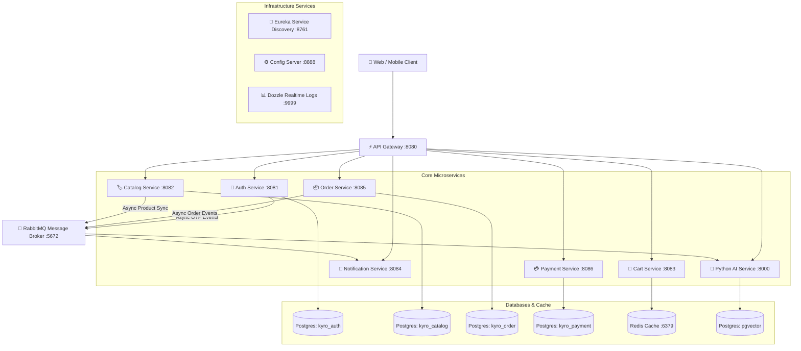

# 🛒 Kyro E-Commerce Microservices Backend Platform

[](https://openjdk.org/projects/jdk/21/)
[](https://spring.io/projects/spring-boot)
[](https://spring.io/projects/spring-cloud)
[](https://fastapi.tiangolo.com/)
[](https://github.com/pgvector/pgvector)
[](https://redis.io/)
[](https://www.rabbitmq.com/)
[](https://www.docker.com/)

> **Kyro Backend** là nền tảng Microservices Thương mại Điện tử hiện đại, thiết kế theo tiêu chuẩn kiến trúc hướng dịch vụ (**Service-Oriented Architecture**), phân tách dữ liệu triệt để (**Database-per-service**), hỗ trợ xác thực tập trung JWT/OAuth2, thanh toán trực tuyến **VNPay**, lưu trữ giỏ hàng siêu tốc trên **Redis**, xử lý sự kiện bất đồng bộ qua **RabbitMQ**, và tích hợp engine AI gợi ý sản phẩm thông minh (**Python FastAPI + Google Gemini AI + pgvector**).

---

## 📚 📖 Danh Mục Tài Liệu Chi Tiết (`docs/`)

> [!IMPORTANT]
> Toàn bộ tài liệu giải thích sâu cặn kẽ về source code, kiến trúc, và hướng dẫn vận hành đã được mô-đun hóa trong thư mục [`docs/`](docs/):

| Chủ Đề | Nội Dung Giải Thích Chi Tiết | Đường Dẫn Đến Tài Liệu |
| :--- | :--- | :---: |
| 🏛️ **Architecture Overview** | Sơ đồ kiến trúc hệ thống, Spring Cloud ecosystem, Service discovery & Routing | [👉 Xem Tài Liệu](docs/architecture/overview.md) |
| 📐 **Clean Architecture Review** | Phân tích Clean/Hexagonal Architecture, Virtual Threads Java 21, Anti-patterns & Roadmap | [👉 Xem Tài Liệu](docs/architecture/clean-architecture-review.md) |
| 🐰 **Event-Driven Messaging** | Thiết kế RabbitMQ Message Broker, Exchanges, Queues, Dead-Letter policy & Payloads | [👉 Xem Tài Liệu](docs/architecture/event-driven-flow.md) |
| 🗄️ **Database Schema Design** | Chi tiết ERD/Schema 5 CSDL PostgreSQL, Redis Cache Key-Value & pgvector 768 dimensions | [👉 Xem Tài Liệu](docs/architecture/database-design.md) |
| ⚡ **API Gateway Service** | Giải thích `AuthenticationFilter`, Dynamic routing, CORS, Header Injection | [👉 Xem Service Doc](docs/services/api-gateway.md) |
| 🔐 **Auth Service** | Spring Security, JWT Token generation, OAuth2 Google/GitHub, Mail OTP lifecycle | [👉 Xem Service Doc](docs/services/auth-service.md) |
| 🏷️ **Catalog Service** | Danh mục sản phẩm, biến thể (Size/Stock), Cloudinary file upload & Product Events | [👉 Xem Service Doc](docs/services/catalog-service.md) |
| 🛒 **Cart Service** | Redis In-Memory Cart State, TTL 30 ngày, Synchronous Feign Client validation | [👉 Xem Service Doc](docs/services/cart-service.md) |
| 📦 **Order Service** | Checkout flow, Order state machine (Pending -> Confirmed -> Delivered), Address snapshot | [👉 Xem Service Doc](docs/services/order-service.md) |
| 💳 **Payment Service** | Tích hợp cổng thanh toán VNPay, tạo URL có chữ ký HMAC SHA-512 và xử lý callback | [👉 Xem Service Doc](docs/services/payment-service.md) |
| 🔔 **Notification Service** | Consumer RabbitMQ, Thymeleaf HTML Email templates & Async SMTP sending | [👉 Xem Service Doc](docs/services/notification-service.md) |
| 🤖 **AI Recommendation Service** | Python FastAPI, Gemini AI Embedding API, pgvector Cosine Similarity Search | [👉 Xem Service Doc](docs/services/ai-service.md) |
| 🚀 **Local Development Guide** | Hướng dẫn cài đặt local dev, Docker Compose, Go Task shortcuts & Hot-Reload | [👉 Xem Tài Liệu](docs/setup/local-development.md) |
| ⚙️ **Environment Variables** | Giải thích toàn bộ thông số và cấu hình biến môi trường trong `.env` | [👉 Xem Tài Liệu](docs/setup/environment-variables.md) |
| 🔍 **Troubleshooting Guide** | Xử lý lỗi xung đột cổng, Spotless formatting violations, RabbitMQ/Postgres issues | [👉 Xem Tài Liệu](docs/setup/troubleshooting.md) |
| 📮 **Postman Collection Guide** | Hướng dẫn import `kyro_postman_collection.json` và test chuỗi API | [👉 Xem Tài Liệu](docs/api/postman-guide.md) |
| 📖 **Swagger & OpenAPI Docs** | Hướng dẫn xem Swagger UI tập trung qua Gateway `:8080` và FastAPI `:8000` | [👉 Xem Tài Liệu](docs/api/swagger-scalar.md) |

---

## 🌟 1. Highlights & Tính Năng Nổi Bật (Key Features)

- **Định Tuyến & Xác Thực Tập Trung**: API Gateway chịu trách nhiệm xác thực JWT chữ ký số và tự động chèn HTTP Headers (`X-User-Id`, `X-User-Email`, `X-User-Roles`) chuyển tiếp cho các dịch vụ phía trong.
- **Xác Thực Đa Phương Thức**: Đăng nhập bằng Email/Password mã hóa BCrypt, khôi phục bằng OTP qua Email, hoặc đăng nhập 1-click qua **OAuth2 (Google & GitHub)**.
- **Giỏ Hàng Siêu Tốc Trên Redis**: Giỏ hàng tạm thời với thời gian sống (TTL 30 ngày) được lưu trữ dạng In-Memory Key-Value cho tốc độ phản hồi tính bằng milisecond.
- **Thanh Toán Trực Tuyến VNPay**: Tạo link thanh toán VNPay Sandbox an toàn với chữ ký bảo mật **HMAC SHA-512** và xử lý tự động callback Webhook (IPN).
- **Gửi Email Bất Đồng Bộ**: `notification-service` làm consumer lắng nghe RabbitMQ Queues gửi email OTP và hóa đơn xác nhận đơn hàng mà không gây lag request client.
- **Gợi Ý Sản Phẩm AI (Semantic Search)**: `ai-service` viết bằng Python FastAPI sử dụng **Google Gemini AI** chuyển thông tin sản phẩm thành **Vector 768 chiều** và lưu trữ trong **PostgreSQL pgvector** để tìm kiếm khoảng cách Cosine Similarity.
- **Cơ Chế Hot-Reload 1 Giây**: Tích hợp **Spring Boot DevTools** và **Go Task (`Taskfile.yml`)** cho phép dev sửa code và nhận kết quả nạp lại tức thì mà không cần rebuild lại container Docker.

---

## 🌴 2. Sơ Đồ Cấu Trúc Thư Mục Repository (Directory Tree)

```text
backend/
├── README.md                          # 🏠 Main Entrypoint & Overview Documentation
├── Taskfile.yml                       # ⚡ Go Task Automation Shortcuts (Hot-Reload, Format, DB)
├── compose.yml                        # 🐳 Docker Compose Orchestration (11 Services)
├── pom.xml                            # 📦 Root Parent Maven POM (Spring Boot 3.3.2)
├── .env.example                       # ⚙️ Master Environment Variables Template
├── kyro_postman_collection.json       # 📮 Complete API Postman Testing Collection
│
├── docs/                              # 📚 Modular Documentation Directory
│   ├── architecture/                  # 🏛️ System Architecture, Clean Arch, Event Flows & DB Schema
│   ├── services/                      # 🛠️ Deep-dive Docs for each of the 8 Microservices
│   ├── setup/                         # 🚀 Dev Setup, Environment Vars & Troubleshooting Guides
│   └── api/                           # 📡 Postman & Swagger OpenAPI Testing Guides
│
├── api-gateway/                       # ⚡ API Gateway (Spring Cloud Gateway :8080)
├── auth-service/                      # 🔐 Authentication & User Service (Postgres :8081)
├── catalog-service/                   # 🏷️ Product Catalog & Stock Service (Postgres :8082)
├── cart-service/                      # 🛒 Cart Service (Redis Cache :8083)
├── notification-service/              # 🔔 Async Email Notification Service (RabbitMQ :8084)
├── order-service/                     # 📦 Order & Checkout Service (Postgres :8085)
├── payment-service/                   # 💳 Payment & VNPay Service (Postgres :8086)
├── eureka-server/                     # 🔎 Service Discovery Server (:8761)
├── config-server/                     # ⚙️ Centralized Cloud Config Server (:8888)
├── docker/                            # 🐳 Database Init Scripts & Postgres Dockerfiles
└── ../ai-service/                     # 🤖 Python FastAPI + Gemini AI + pgvector Service (:8000)
```

---

## 🏛️ 3. Sơ Đồ Kiến Trúc Hệ Thống (System Architecture Map)



---

## 🛠️ 4. Danh Sách Các Microservices & Infrastructure

| Microservice Name | Cổng (Port) | Stack Công Nghệ | Storage / Database | Chức Năng Chính |
| :--- | :---: | :--- | :--- | :--- |
| **`api-gateway`** | `8080` | Spring Cloud Gateway | *N/A* | Giải mã JWT token, chèn header định danh, CORS & routing tập trung. |
| **`auth-service`** | `8081` | Spring Security + OAuth2 | PostgreSQL (`kyro_auth`) | Quản lý tài khoản, mã hóa BCrypt, OAuth2 Google/GitHub, OTP qua RabbitMQ. |
| **`catalog-service`** | `8082` | Spring Boot 3 + Cloudinary | PostgreSQL (`kyro_catalog`) | Quản lý sản phẩm, biến thể Size/Stock, review, phát sự kiện sync AI. |
| **`cart-service`** | `8083` | Spring Boot 3 + Redis | Redis (`kyro-redis`) | Lưu giỏ hàng tạm thời với TTL 30 ngày, gọi Feign check tồn kho. |
| **`notification-service`** | `8084` | Spring Boot 3 + JavaMail | *N/A* | Consumer lắng nghe RabbitMQ gửi email OTP và hóa đơn HTML. |
| **`order-service`** | `8085` | Spring Boot 3 + OpenFeign | PostgreSQL (`kyro_order`) | Xử lý checkout, tính toán chiết khấu, quản lý vòng đời trạng thái đơn hàng. |
| **`payment-service`** | `8086` | Spring Boot 3 + VNPay SDK | PostgreSQL (`kyro_payment`) | Tạo URL thanh toán VNPay SHA-512 & xử lý Webhook IPN Callback. |
| **`ai-service`** | `8000` | Python FastAPI + Gemini AI | Postgres (`pgvector`) | Engine tìm kiếm ngữ nghĩa & gợi ý sản phẩm bằng Vector 768 chiều. |
| **`eureka-server`** | `8761` | Spring Cloud Eureka | In-Memory | Register & Service Discovery động cho các microservices. |
| **`config-server`** | `8888` | Spring Cloud Config | Local Configs | Quản lý file cấu hình tập trung cho toàn bộ ứng dụng. |
| **`dozzle`** | `9999` | Dozzle Go Engine | Docker Socket | Giao diện Web xem realtime logs từ tất cả Docker Containers. |

---

## ⚡ 5. Quy Trình Phát Triển Cục Bộ (Fast Local Dev Workflow)

Dự án sử dụng **Docker Compose** kết hợp **Go Task (`task`)** để mang lại trải nghiệm phát triển tối ưu nhất:

### 📌 Yêu Cầu Cài Đặt
- **Docker & Docker Compose** (V2+)
- **Java 21 LTS** & **Maven 3.9+** (Hoặc dùng wrapper `./mvnw`)
- **Go Task** (`brew install go-task` / `scoop install task`)

### 🚀 Lộ Trình Khởi Động Rapid Development Mode
1. **Khởi động Hạ tầng ngầm (Chạy 1 lần)**:
   ```bash
   task infra
   ```
   *(Container DB Postgres, Redis, RabbitMQ, Gateway, Eureka, Config sẽ khởi chạy ngầm)*.

2. **Chạy Service bạn đang viết code bằng Hot-Reload Mode**:
   ```bash
   # Sửa code & Hot-Reload tức thì sau 1s cho Auth Service
   task dev:auth

   # Hoặc cho Catalog Service
   task dev:catalog

   # Hoặc Order Service
   task dev:order
   ```

---

## 🐳 6. Shortcuts Tiện Ích Trong `Taskfile.yml`

| Lệnh `task` | Mô Tả Chi Tiết |
| :--- | :--- |
| `task infra` | **[KHUYÊN DÙNG]** Bật toàn bộ container hạ tầng ngầm (Postgres, Redis, RabbitMQ, Gateway, Eureka, Config). |
| `task dev:<service>` | **[HOT-RELOAD]** Chạy service cục bộ ở máy host (kèm phản hồi 1s khi nhấn Ctrl+S). |
| `task run` | Build và bật TOÀN BỘ 11 Docker Containers trong `compose.yml`. |
| `task stop` | Dừng tất cả các container Docker đang chạy. |
| `task clean` | Dừng hệ thống và **XÓA SẠCH** Volume dữ liệu PostgreSQL & Redis. |
| `task format` | Tự động căn chỉnh định dạng mã nguồn theo Google Java Format (Spotless). |
| `task format:check` | Kiểm tra định dạng code Java (Dùng cho CI/CD Build Pipeline). |
| `task test` | Chạy toàn bộ Unit Tests trong toàn hệ thống backend. |
| `task logs:ui` | Mở giao diện xem log thời gian thực Dozzle (`http://localhost:9999`). |

---

## 🎨 7. Chuẩn Hóa Định Dạng Code (Spotless & Google Java Style)

Dự án áp dụng quy chuẩn mã nguồn nghiêm ngặt với plugin **Spotless** (Google Java Format style):

- **Tự động định dạng toàn bộ mã nguồn Java**:
  ```bash
  task format
  # Hoặc: ./mvnw spotless:apply
  ```
- **Kiểm tra định dạng (Dành cho CI/CD Pipeline)**:
  ```bash
  task format:check
  # Hoặc: ./mvnw spotless:check
  ```

---

## 📊 8. Trực Quan Log & Tài Liệu API

- **Dozzle Realtime Log Viewer**: Truy cập `http://localhost:9999` để theo dõi live log từ tất cả 11 container.
- **Swagger / OpenAPI Gateway Docs**: Truy cập `http://localhost:8080/v3/api-docs` để xem tài liệu API tổng hợp.
- **Python AI Service Swagger**: Truy cập `http://localhost:8000/docs`.
- **RabbitMQ Dashboard**: Truy cập `http://localhost:15672` (User: `guest`, Pass: `guest`) để kiểm tra Queues & Messages.

---

## 📄 License & Author

- **Project**: Kyro Microservices E-Commerce Platform
- **Architecture Standard**: Java 21 LTS, Spring Boot 3.3, Python FastAPI, Clean Architecture & Event-Driven Microservices.
