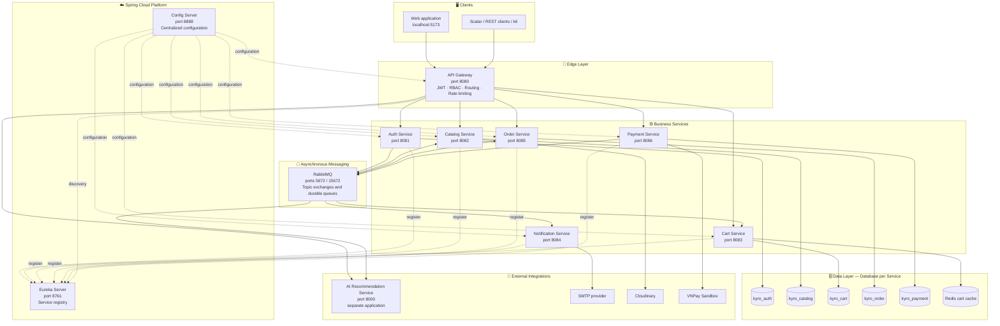
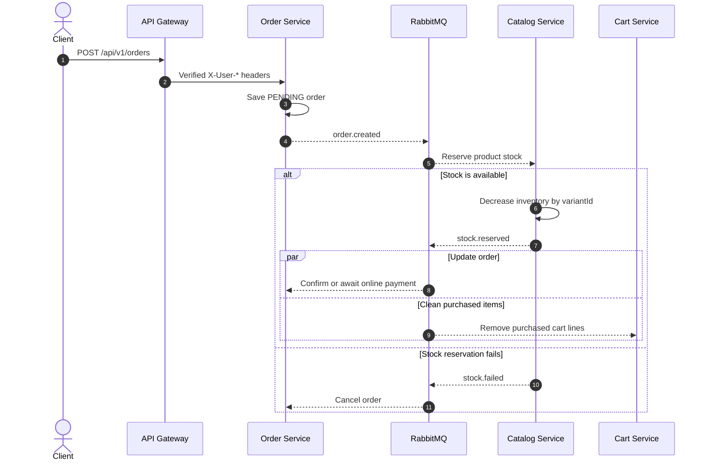

# Kyro E-Commerce Backend

[](https://openjdk.org/projects/jdk/21/)
[](https://spring.io/projects/spring-boot)
[](https://docs.docker.com/compose/)

Kyro is a microservices backend for an e-commerce platform. It provides centralized authentication and routing, product and inventory management, persistent carts, order processing, VNPay payments, asynchronous notifications, and an integration point for an external AI recommendation service.

## Features

- JWT authentication and role-based authorization at the API Gateway
- Email/password and Google/GitHub OAuth2 authentication
- Database-per-service persistence with PostgreSQL
- Redis cache-aside for persistent shopping carts
- RabbitMQ events for notifications and cross-service workflows
- VNPay payment URL signing and callback handling
- Cloudinary-backed product image management
- Service discovery and centralized configuration with Spring Cloud
- OpenAPI documentation and k6 load-testing scenarios

## Architecture



The repository contains nine Maven modules and a Docker Compose environment with thirteen services. The AI service is a separate application configured through `AI_SERVICE_URI`; it is not built or started by this repository.

### Request and event flow

1. Clients send public and authenticated requests through the API Gateway.
2. The Gateway validates JWTs, enforces route-level roles, removes untrusted identity headers, and forwards verified `X-User-*` headers to downstream services.
3. Cart revalidates the selected `variantId`, active status, stock, and backend-calculated price; Order stores immutable item snapshots and publishes `order.created`.
4. Catalog reserves stock by `variantId` and publishes `stock.reserved` or `stock.failed`.
5. A successful reservation updates the order and removes only the purchased cart items. A failed reservation cancels the order.
6. Payment publishes `payment.status.updated` after its database transaction commits; Order consumes the event and updates payment state.
7. Auth and Order publish email events consumed by Notification. Catalog publishes product lifecycle events for the external AI index.

### Checkout saga



## Services

| Service | Port | Responsibility | Storage |
| --- | ---: | --- | --- |
| API Gateway | `8080` | Routing, JWT validation, role checks, rate limiting | Redis |
| Auth | `8081` | Accounts, JWT, OAuth2, OTP | PostgreSQL |
| Catalog | `8082` | Products, variants, attributes, inventory, reviews, images | PostgreSQL, Cloudinary |
| Cart | `8083` | Persistent carts and product validation | PostgreSQL, Redis |
| Notification | `8084` | Asynchronous email delivery | RabbitMQ |
| Order | `8085` | Checkout and order lifecycle | PostgreSQL |
| Payment | `8086` | VNPay payments and callbacks | PostgreSQL |
| Eureka Server | `8761` | Service discovery | In memory |
| Config Server | `8888` | Centralized service configuration | Local configuration files |
| AI service (external) | `8000` | Recommendation and semantic-search endpoints | Managed outside this repository |

PostgreSQL, Redis, RabbitMQ, and [Dozzle](https://dozzle.dev/) are also started by Docker Compose.

## Tech Stack

- Java 21, Spring Boot 3.3, Spring Cloud 2023.0
- Spring Security, OAuth2 Client, JJWT, OpenFeign
- PostgreSQL 16 with Flyway migrations, Redis 7, RabbitMQ 3
- Maven Wrapper, Spotless with Google Java Format
- Docker Compose, Go Task, k6

## Design Decisions

| Decision | Implementation |
| --- | --- |
| Centralized edge security | Spring Cloud Gateway validates JWTs and applies role checks before protected requests reach a service. |
| Trusted service identity | The Gateway strips client-supplied identity headers and injects values derived from verified token claims. |
| Database isolation | Auth, Catalog, Cart, Order, and Payment use separate PostgreSQL databases and Flyway migrations. |
| Persistent cache | PostgreSQL remains the cart source of truth; Redis accelerates reads through a cache-aside strategy. |
| Event-driven checkout | RabbitMQ decouples stock reservation, cart cleanup, payment updates, and notification delivery. |
| AI failure isolation | AI routes use rate limiting and a circuit breaker; the SSE route bypasses buffering for streaming responses. |
| Internal service calls | OpenFeign clients use a shared internal token when synchronous validation is required. |

## Getting Started

### Prerequisites

- Docker with Docker Compose v2
- Java 21 for running services outside Docker
- [Go Task](https://taskfile.dev/) for the documented command shortcuts

### Run the complete backend

```bash
cp .env.example .env
# Replace placeholder credentials and secrets in .env.
task run
```

`task run` builds the Java services, starts the complete Compose environment, and waits for service health checks. The external AI service must be started separately when testing `/api/v1/ai/**`; set `AI_SERVICE_URI` if it is not available at `http://localhost:8000`.

Useful local endpoints:

| Resource | URL |
| --- | --- |
| API Gateway | <http://localhost:8080> |
| Scalar API reference | <http://localhost:8080/scalar> |
| Eureka dashboard | <http://localhost:8761> |
| RabbitMQ management | <http://localhost:15672> |
| Dozzle logs | <http://localhost:9999> |

### Common commands

```bash
task status          # Show container health and status
task logs:cli        # Follow Docker Compose logs
task test            # Run the Maven test suite
task format:check    # Check Java formatting
task perf:feign      # Measure synchronous checkout dependencies
task perf:rabbitmq   # Measure payment event propagation
task perf:payment-failure # Exercise the failed-payment path
task stop            # Stop the Compose environment
```

Run `task --list` to see all service-specific and k6 commands.

> [!WARNING]
> `task clean` stops the environment and permanently removes its Docker volumes, including local database data.

## Configuration

`.env.example` documents the available local settings. Before starting the stack, replace placeholder values for application secrets and any integrations you intend to exercise, including JWT/internal tokens, mail, OAuth2, Cloudinary, and VNPay.

Do not commit `.env` or real credentials. See the [environment variable guide](docs/setup/environment-variables.md) for details.

## API Documentation

With the services running, open the aggregated Scalar UI at <http://localhost:8080/scalar>. Individual OpenAPI specifications are proxied through the Gateway, for example:

```text
http://localhost:8080/auth-service/v3/api-docs
http://localhost:8080/catalog-service/v3/api-docs
http://localhost:8080/cart-service/v3/api-docs
```

## Development and Testing

```bash
./mvnw test              # Run the Maven tests
./mvnw spotless:check    # Verify Google Java Format
./mvnw clean package     # Build all Maven modules
```

The [`k6/performance`](k6/performance/) directory contains focused Feign, RabbitMQ, and failed-payment measurements. Authenticated scenarios require a dedicated customer account configured through `K6_USER_EMAIL` and `K6_USER_PASSWORD`.

For project-defense preparation and a source-verified explanation of the current implementation, read:

- [Architecture overview](docs/architecture/overview.md)
- [RabbitMQ and OpenFeign usage](docs/architecture/rabbitmq-feign-current-usage.md)
- [Event-driven flows and failure risks](docs/architecture/event-driven-flow.md)
- [Detailed defense handbook](docs/defense/defense-handbook.md)
- [200 self-review questions](docs/defense/self-review-questions.md)

## Repository Layout

```text
.
├── api-gateway/          # Gateway, authentication filter, and routes
├── auth-service/         # Identity and access management
├── catalog-service/      # Catalog, stock, reviews, and images
├── cart-service/         # Persistent cart and Redis cache
├── order-service/        # Checkout and order lifecycle
├── payment-service/      # VNPay integration
├── notification-service/# RabbitMQ email consumer
├── config-server/        # Centralized Spring configuration
├── eureka-server/        # Service discovery
├── docker/               # PostgreSQL initialization
├── docs/                 # Architecture, service, API, and setup guides
└── k6/                   # Performance and resilience scenarios
```
