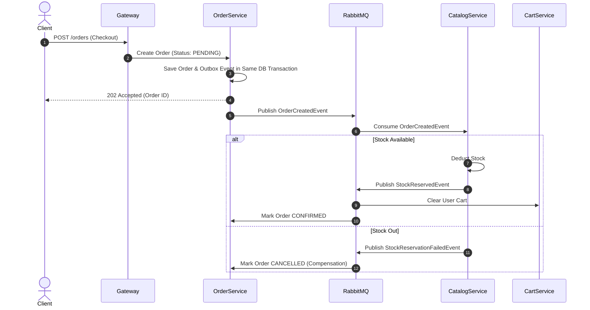
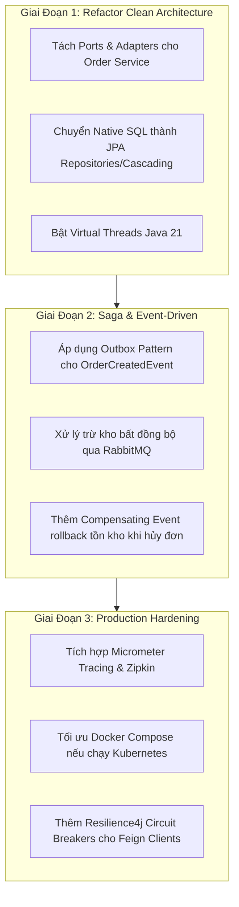

# 🏛️ Đánh Giá Kiến Trúc Microservices & Clean Architecture

> **Dành cho Lập Trình Viên & Architects**: Tài liệu này phân tích chi tiết hệ thống Backend Microservices của **Kyro**, đánh giá theo các chuẩn mực **Clean Architecture**, **Java 21 / Spring Boot 3**, chỉ ra các điểm làm tốt, các anti-pattern cần tránh và lộ trình cải tiến nâng cao.

---

## 📌 1. Bức Tranh Tổng Quan & Điểm Sáng Hệ Thống

Dự án **Kyro Backend** được xây dựng với tư duy tổ chức mã nguồn hiện đại, phân tách dịch vụ rõ ràng.

### 🌟 Những Điểm Sáng Nổi Bật (Strengths)
1. **Stack Công Nghệ Hiện Đại**: Sử dụng **Java 21 LTS**, **Spring Boot 3.3.2**, **Spring Cloud 2023.0.3**, **PostgreSQL 16** (kèm extension `pgvector`), **Redis 7**, **RabbitMQ 3**, và **Python FastAPI**.
2. **Nguyên Tắc Database-per-service**: Phân tách dữ liệu triệt để. Mỗi microservice sở hữu cơ sở dữ liệu riêng (`kyro_auth`, `kyro_catalog`, `kyro_order`, `kyro_payment`, Redis cho `cart-service`, Postgres + pgvector cho `ai-service`).
3. **Trải Nghiệm Phát Triển Cực Tốt (Developer Experience - DX)**:
   - Tích hợp `Taskfile.yml` với các shortcut lệnh ngắn gọn.
   - Áp dụng **Spring Boot DevTools** cho phép **Hot-Reload chỉ 1 - 2 giây** (`task dev:<service>`).
   - Tự động căn chỉnh format theo chuẩn **Google Java Format** thông qua plugin **Spotless** (`task format`).
   - Tích hợp giao diện quản trị log **Dozzle** xem log trực quan thời gian thực trên web (`:9999`).
4. **Quản Lý Schema Database Chuẩn Xác**: Tất cả các dịch vụ SQL đều tích hợp **Flyway Migration** (`src/main/resources/db/migration/`), đảm bảo quản lý phiên bản database đồng nhất trên môi trường dev và prod.
5. **Định Tuyến & Xác Thực Tập Trung**: **API Gateway** đảm nhận việc lọc JWT token (`AuthenticationFilter.java`) và inject header (`X-User-Id`, `X-User-Email`, `X-User-Roles`) chuyển tiếp cho các dịch vụ phía trong.
6. **Xử Lý Bất Đồng Bộ Đúng Đắn**: `notification-service` đóng vai trò consumer lắng nghe sự kiện RabbitMQ để gửi Email OTP và Mail xác nhận đơn hàng không gây nghẽn request chính.

---

## 🏛️ 2. Đánh Giá Theo Chuẩn Clean Architecture (Hexagonal Architecture)

### 🔴 Hiện Trạng Cấu Trúc Mã Nguồn
Hiện tại, các microservices Spring Boot đang được tổ chức theo mô hình **Layered Monolith / Package-by-Feature**:

```text
com.kyro.order/
├── Order.java                 (JPA Entity)
├── OrderItem.java             (JPA Entity)
├── Address.java               (JPA Entity)
├── OrderRepository.java       (Spring Data JPA)
├── OrderItemRepository.java   (Spring Data JPA)
├── OrderController.java       (REST Controller)
├── AdminOrderController.java  (REST Controller)
├── OrderService.java          (Spring Service - Transaction Script)
├── client/                    (Feign Clients)
└── dto/                       (Data Transfer Objects)
```

### ⚠️ Điểm Chưa Tuân Thủ Clean Architecture
1. **Domain Model bị phụ thuộc chặt chẽ vào Framework (JPA/Hibernate)**:
   - Các class `Order`, `User`, `Product` vừa chứa logic nghiệp vụ, vừa là JPA Entity (`@Entity`, `@Table`, `@OneToMany`).
   - Theo Clean Architecture, **Domain Core phải là Pure Java** (không phụ thuộc `@Entity`, Spring, hay Database).
2. **Service Layer Đóng Vai Trò "Transaction Script"**:
   - `OrderService` đang gánh quá nhiều trách nhiệm (*God Class* trong service): REST validation, gọi HTTP Feign Client, kiểm tra kho, tính toán giá tiền, gọi Native SQL, và phát message RabbitMQ.
3. **Luồng checkout tập trung trong Service Layer**:
   - `OrderService.java` điều phối dữ liệu từ Cart, Catalog và Auth. Đây là điểm cần được kiểm thử kỹ vì nó là ranh giới giao tiếp liên service, nhưng không sử dụng SQL truy cập chéo database.

### 🎯 Mô Hình Target Hexagonal Architecture (Ports and Adapters)
Một microservice tuân thủ Hexagonal Architecture chuẩn nên được tổ chức thành 3 tầng rõ rệt:

```text
com.kyro.order/
├── domain/                      # 1. Pure Java Domain (Không phụ thuộc Framework)
│   ├── model/                   #    Order, OrderItem, OrderStatus (Pure Java objects)
│   ├── exception/               #    Domain exceptions
│   └── port/                    #    Interfaces (Primary & Secondary Ports)
│       ├── in/                  #    CreateOrderUseCase, CancelOrderUseCase
│       └── out/                 #    OrderRepositoryPort, InventoryPort, NotificationPort
├── application/                 # 2. Use Case Implementations & Application Services
│   └── service/                 #    CreateOrderApplicationService
└── infrastructure/              # 3. Adapters (Chi tiết triển khai kỹ thuật)
    ├── adapter/
    │   ├── persistence/         #    JPA Entities, Spring Data Repositories, Mappers
    │   ├── rest/                #    Spring REST Controllers
    │   ├── feign/               #    Feign Clients gọi Catalog/Auth/Cart
    │   └── messaging/           #    RabbitMQ Event Publisher
    └── config/                  #    Spring Configurations
```

---

## ⚡ 3. Đánh Giá Độ Modern Của Codebase (Java 21 & Spring Boot 3.3)

### ✅ Điểm Hiện Đại Đã Áp Dụng
- **Java Records**: Đã áp dụng `record` cho các DTO giao tiếp Feign Client (ví dụ `CartResponse`, `CartItemResponse`, `ProductResponse`).
- **Spring Boot 3.3.2**: Sử dụng phiên bản mới nhất, tương thích đầy đủ với Jakarta EE.
- **Spotless Plugin**: Tự động loại bỏ unused imports và căn chỉnh code chuẩn Google Style.

### 🚀 Cơ Hội Nâng Cấp Nổi Bật
1. **Kích Hoạt Virtual Threads (Project Loom)**:
   - Trong `application.yml` của các microservices, thêm cấu hình:
     ```yaml
     spring:
       threads:
         virtual:
           enabled: true
     ```
   - **Lợi ích**: Giúp các yêu cầu I/O (Database, Feign REST Call, Redis) chạy trên Virtual Thread thay vì Platform Thread của OS, giúp hệ thống phục hồi hàng nghìn request/giây mà không tốn tài nguyên RAM.

2. **Áp Dụng Pattern Matching & Sealed Classes**:
   - Sử dụng Pattern Matching cho `switch` khi xử lý các trạng thái đơn hàng (`OrderStatus`) hoặc loại sự kiện notification.

3. **Bổ Sung Distributed Tracing (Observability)**:
   - Tích hợp `spring-boot-starter-actuator` + `micrometer-tracing-bridge-brave` hoặc OpenTelemetry để truyền `TraceId` và `SpanId` qua tất cả microservices và RabbitMQ messages.

---

## 🛑 4. Các Anti-Patterns Chí Mạng & Hướng Khắc Phục

### ❌ Anti-Pattern 1: Distributed Transaction & Dual Write Problem

Trong `OrderService.java`, phương thức `placeOrder`:
- Mở `@Transactional` ở DB `kyro_order`.
- Gọi HTTP Feign sang `catalog-service` để giảm stock -> DB `kyro_catalog` **COMMIT NGAY**.
- Sau đó nếu lưu order bị lỗi ở `kyro_order` -> DB `kyro_order` **ROLLBACK**.
- **Hậu quả**: Tồn kho Catalog đã bị trừ mất nhưng đơn hàng không hề tồn tại (Data Inconsistency).

#### 🛠️ Giải pháp chuẩn kiến trúc Microservices:
Áp dụng **Saga Pattern (Event-Driven Choreography)** kết hợp **Transactional Outbox Pattern**:



---

### ❌ Anti-Pattern 2: Shared Enums Copy-Paste Trùng Lặp

- Các Enum như `OrderStatus`, `PaymentMethod`, `PaymentStatus` đang bị copy-paste thủ công sang nhiều service.
- **Giải pháp**: Tạo thư viện dùng chung `kyro-common` hoặc sinh mã DTO/Enum tự động từ OpenAPI Schema specs.

---

## 🗺️ 5. Lộ Trình Refactoring Chi Tiết (Actionable Step-by-Step Roadmap)


