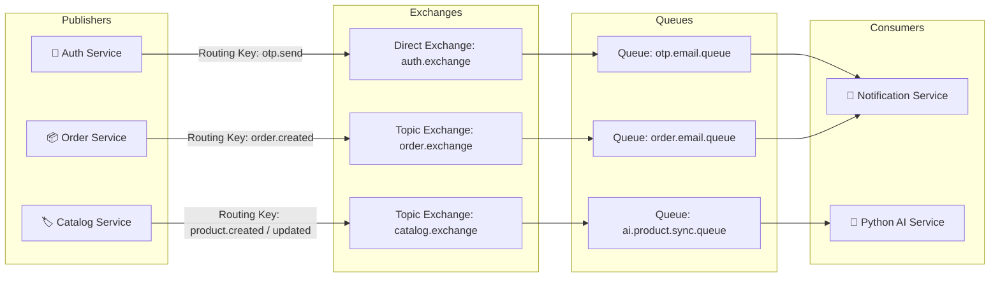

# 🐰 Event-Driven Messaging Architecture (RabbitMQ)

> Tài liệu này mô tả chi tiết thiết kế hệ thống tin nhắn bất đồng bộ (**Event-Driven Messaging**) trong hệ thống Kyro Backend, sử dụng **RabbitMQ Message Broker**.

---

## 📐 1. Sơ Đồ Luồng Truyền Tin Event-Driven



---

## 🗄️ 2. Danh Sách Exchanges, Queues & Routing Keys

| Service Publisher | Exchange Name | Exchange Type | Routing Key | Queue Target | Service Consumer | Nhiệm Vụ |
| :--- | :--- | :--- | :--- | :--- | :--- | :--- |
| `auth-service` | `auth.exchange` | `direct` | `otp.send` | `otp.email.queue` | `notification-service` | Gửi email chứa mã OTP xác nhận tài khoản / quên mật khẩu. |
| `order-service` | `order.exchange` | `topic` | `order.created` | `order.email.queue` | `notification-service` | Gửi email thông báo đặt hàng thành công & chi tiết hóa đơn. |
| `catalog-service` | `catalog.exchange` | `topic` | `product.created` | `ai.product.sync.queue` | `ai-service` (Python) | Sinh vector embedding cho sản phẩm mới và lưu vào `pgvector`. |
| `catalog-service` | `catalog.exchange` | `topic` | `product.updated` | `ai.product.sync.queue` | `ai-service` (Python) | Cập nhật lại vector embedding khi thông tin sản phẩm thay đổi. |
| `catalog-service` | `catalog.exchange` | `topic` | `product.deleted` | `ai.product.sync.queue` | `ai-service` (Python) | Xóa vector embedding của sản phẩm khỏi database `pgvector`. |

---

## 📩 3. Cấu Trúc Message Payloads (JSON Specifications)

### 3.1. OTP Email Event (`otp.email.queue`)
```json
{
  "email": "user@example.com",
  "otp": "839201",
  "type": "REGISTRATION_OTP",
  "expirationMinutes": 10,
  "timestamp": "2026-08-02T21:00:00Z"
}
```

### 3.2. Order Confirmation Event (`order.email.queue`)
```json
{
  "orderId": 1052,
  "orderNumber": "ORD-20260802-9912",
  "userEmail": "customer@example.com",
  "customerName": "Nguyen Van A",
  "totalAmount": 1450000.00,
  "paymentMethod": "VNPAY",
  "shippingAddress": "123 Le Loi, District 1, HCMC",
  "items": [
    {
      "productName": "Áo Thun Premium Kyro",
      "quantity": 2,
      "price": 350000.00,
      "subtotal": 700000.00
    },
    {
      "productName": "Quần Jeans Slimfit",
      "quantity": 1,
      "price": 750000.00,
      "subtotal": 750000.00
    }
  ]
}
```

### 3.3. Product Sync Event (`ai.product.sync.queue`)
```json
{
  "event_id": "evt-88192301",
  "event_type": "ProductUpdated",
  "occurred_at": "2026-08-02T21:05:00Z",
  "data": {
    "product_id": 42,
    "title": "Laptop Kyro Pro",
    "brand": "Kyro",
    "category_id": 11,
    "category_name": "Laptop",
    "original_price": 1200000,
    "discounted_price": 1080000,
    "discount_percent": 10,
    "average_rating": 4.5,
    "num_ratings": 12,
    "image_url": "https://example.com/product.jpg",
    "is_active": true
  }
}
```

---

## 🛡️ 4. Xử Lý Lỗi & Đảm Bảo Tin Nhắn (Reliability & Retry Policy)

1. **Jackson JSON Serialization**: Tất cả các Java service đều sử dụng `Jackson2JsonMessageConverter` để tự động mã hóa/giải mã DTO sang JSON byte arrays.
2. **RabbitMQ Acknowledgement**:
   - Consumers được cấu hình **Auto-Ack / Manual-Ack** đảm bảo tin nhắn không bị mất khi service bị crash giữa chừng.
3. **Dead-Letter Exchange (DLX) Design**:
   - Các tin nhắn bị lỗi quá 3 lần retry sẽ tự động được chuyển sang Dead Letter Queue (`dlq.notification` / `dlq.ai.sync`) để phục vụ việc kiểm tra và retry lại thủ công.
