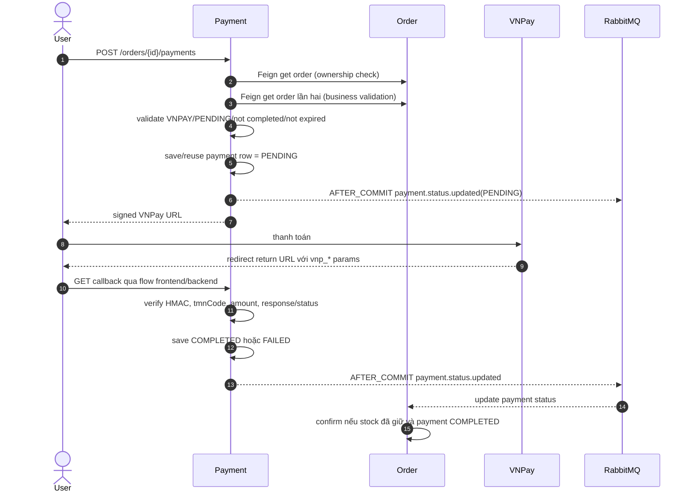

# Luồng event-driven RabbitMQ hiện tại

> Đây là hiện trạng source ngày 2026-08-17, không phải kiến trúc mục tiêu. Không có DLQ, retry policy tùy chỉnh, manual acknowledgement, publisher confirm hay transactional outbox trong repository.

## 1. Topology thực tế

| Exchange | Routing key | Queue | Publisher | Consumer | Payload chính |
| --- | --- | --- | --- | --- | --- |
| `notification-exchange` | `notification.otp` | `otp-queue` | Auth | Notification | `email`, `otp`, `expirationMinutes` |
| `notification-exchange` | `notification.order` | `order-queue` | Order | Notification | `email`, nested `order` snapshot |
| `order-exchange` | `order.created` | `catalog-order-created-queue` | Order | Catalog | order/user + cart item/product/variant/quantity |
| `order-exchange` | `stock.reserved` | `order-saga-queue` | Catalog | Order | order/user/items + `success=true` |
| `order-exchange` | `stock.failed` | `order-saga-queue` | Catalog | Order | order/user + `success=false` |
| `order-exchange` | `stock.reserved` | `cart-clear-queue` | Catalog | Cart | cùng event, dùng cartItemId + quantity |
| `payment-exchange` | `payment.status.updated` | `order-payment-status-queue` | Payment | Order | `orderId`, status |
| `order-exchange` | `order.delivered` | `catalog-order-delivered-queue` | Order | Catalog | orderId + productId/quantity gộp |
| `product.events` | `product.created/updated/deleted` | Không khai báo trong repo | Catalog | AI ngoài repo | envelope event + product data |

Các queue Java khai báo đều durable. Exchange Java là topic exchange. `product.events` chỉ là tên khi publish; Catalog không khai báo bean exchange này, nên AI/infrastructure bên ngoài phải tạo exchange trước.

## 2. Checkout và giữ tồn kho

```mermaid
sequenceDiagram
    autonumber
    actor Client
    participant O as Order
    participant C as Cart
    participant A as Auth
    participant R as RabbitMQ
    participant P as Catalog

    Client->>O: POST /api/v1/orders + cart ids/version/expected total
    O->>C: Feign getSelection
    C->>P: Feign batch product lookup
    P-->>C: variant active/stock/current prices
    C-->>O: selected cart snapshot
    O->>A: Feign get owned address
    A-->>O: address
    O->>O: save PENDING order + item/address snapshots
    Note over O,R: AFTER_COMMIT
    O-->>R: order.created
    R-->>P: catalog-order-created-queue
    P->>P: lock variants and decrement in one DB transaction
    alt reserve succeeds
        P-->>R: stock.reserved
        par order branch
            R-->>O: order-saga-queue
            O->>O: stockReserved=true; confirm COD or paid VNPay
        and cart branch
            R-->>C: cart-clear-queue
            C->>C: remove purchased quantities once/orderId
        end
    else reserve fails
        P-->>R: stock.failed
        R-->>O: order-saga-queue
        O->>O: cancel order
    end
```

### Điều đảm bảo đang có

- Order tạo snapshot trước và event chỉ publish `AFTER_COMMIT`, consumer không thấy order chưa commit.
- Catalog `reserveStock` là transaction; variant được khóa `PESSIMISTIC_WRITE`. Nếu item thứ sau lỗi, toàn bộ lần trừ stock rollback, không phải trừ dở.
- Cart cleanup dùng `processed_cart_events(order_id)` và row lock cart nên cùng event giao lại không xóa hai lần.
- Order lock row khi nhận kết quả và chỉ áp dụng stock result nếu order còn `PENDING`.
- `stock.reserved` fan-out bằng hai queue riêng, không phải hai consumer tranh nhau trên một queue.

### Điều chưa đảm bảo

- Catalog chưa idempotent với `order.created`: event giao lại có thể trừ stock lần hai.
- Sau khi transaction Catalog đã commit stock, publish `stock.reserved` có thể thất bại. Catch block còn thử publish `stock.failed`: nếu lần hai cũng lỗi thì Order/Cart không biết stock đã bị trừ; nếu lần hai thành công thì Order bị hủy dù stock đã giảm. Không có outbox/reconciliation để đóng failure window này.
- Order publisher bắt lỗi Rabbit sau DB commit. COD order có thể kẹt `PENDING` vô thời hạn; scheduler hiện chỉ dọn VNPay.
- Hai queue stock result độc lập: order có thể confirm trước khi cart được dọn, hoặc cart đã dọn trong khi order consumer đang lỗi. Đây là eventual consistency bình thường, nhưng thiếu retry/DLQ/reconciliation làm trạng thái lệch có thể tồn tại lâu.

## 3. VNPay và trạng thái thanh toán



`VNPAY_RETURN_URL` mặc định trỏ frontend `/checkout?step=4`, còn backend expose `/api/v1/payment-providers/vnpay/callback`. Repository backend không chứng minh frontend chuyển toàn bộ query params sang callback; khi bảo vệ chỉ nói backend xử lý callback khi endpoint được gọi, không khẳng định có server-to-server IPN.

### Khi thanh toán thất bại

1. Payment row chuyển `FAILED` và phát event.
2. Order nhận `FAILED` nhưng vẫn `PENDING`; stock nếu đã giữ vẫn giữ nguyên để user có thể tạo link và thanh toán lại.
3. `expires_at = createdAt + 15 phút`.
4. Scheduler chạy mỗi 30 giây nhưng dùng grace 5 phút, nên thực tế chỉ chọn order khi `expires_at <= now - 5 phút`: khoảng 20 phút sau lúc tạo.
5. Scheduler gọi Feign hoàn từng variant, rồi chuyển order/payment status phía Order thành `CANCELLED`.
6. Nếu Catalog lỗi, transaction Order rollback và scheduler thử lại ở vòng sau.

### Race callback và hết hạn

- Nếu Order hủy/hoàn kho trước rồi payment callback thành công, Payment DB có thể `COMPLETED` nhưng Order consumer thấy order `CANCELLED` và bỏ qua late success.
- Grace 5 phút giảm khả năng callback đến muộn nhưng không loại bỏ race/mất callback.
- Trạng thái lúc đó bất đồng: tiền đã thu, order hủy, stock đã hoàn. Code log “manual refund may be required”.

### Refund hiện tại

Không có refund tự động. Không có controller/service gọi VNPay refund API. `vnpay.apiUrl` có config nhưng không được inject/dùng; enum `REFUNDED` chỉ là giá trị dự phòng. Khi hủy order VNPAY đã `COMPLETED`, Order giữ payment status `COMPLETED` để không nói sai rằng tiền đã hoàn và chỉ log yêu cầu hoàn thủ công.

## 4. Email

### OTP

Auth tạo OTP trong memory rồi publish `notification.otp`. Notification consume và gọi SMTP. Auth bắt lỗi publish và chỉ log OTP; API đăng ký vẫn có thể trả thành công dù email không được gửi.

### Xác nhận order

Email không gửi ngay khi order vừa `PENDING`. Khi order lần đầu chuyển `CONFIRMED` (COD sau reserve; VNPay sau cả reserve và payment), Order tạo `OrderConfirmedEvent`; listener `AFTER_COMMIT` publish `notification.order`; Notification chỉ gửi nếu payload status đúng `CONFIRMED`.

Notification listener và `EmailService` đều bắt exception, không throw lại. Vì vậy lỗi SMTP thường được coi là consume thành công và message không redeliver.

## 5. Giao hàng và thống kê bán

Khi admin chuyển `SHIPPED → DELIVERED`, Order:

1. đặt order `DELIVERED`, payment `COMPLETED`, deliveryDate hiện tại;
2. gộp quantity theo `productId`;
3. phát local `OrderDeliveredEvent`;
4. sau commit publish `order.delivered`;
5. Catalog consume trong transaction, insert `processed_order_delivery(order_id) ON CONFLICT DO NOTHING`, rồi cộng `product.quantity_sold`.

Consumer này idempotent. Tuy nhiên publish vẫn không có outbox nên event mất sẽ làm quantitySold/analytics Catalog thấp hơn Order.

## 6. Đồng bộ product sang AI

Catalog publish `product.created`, `product.updated`, `product.deleted`. Payload có `event_id`, `event_type`, `occurred_at`, `data`. Publisher gọi trực tiếp trong transaction business, tự bắt lỗi và không làm request thất bại.

Rủi ro:

- Không `AFTER_COMMIT`: AI có thể nhận event trước khi transaction Catalog commit, hoặc nhận event dù transaction sau đó rollback.
- Không outbox/retry; broker/exchange lỗi chỉ được log.
- Không topology consumer trong repo, nên không thể chứng minh end-to-end chỉ bằng backend Java.

## 7. Acknowledgement, redelivery và thứ tự

- Source không đặt manual ack; dùng mặc định Spring AMQP container.
- Listener throw exception thường có thể bị container requeue theo cấu hình mặc định, nhưng các listener Notification và Catalog stock lại bắt nhiều exception và không throw, nên message được xem là xử lý xong.
- Không nên cam kết “exactly once”. Hệ thống gần với at-least-once ở broker/consumer nhưng các đoạn bắt lỗi làm đảm bảo yếu đi.
- RabbitMQ giữ thứ tự trong một queue trong điều kiện đơn giản, nhưng nhiều queue/consumer và retry khiến không nên dùng thứ tự toàn cục làm invariant.

## 8. Hướng nâng cấp theo ưu tiên

1. Transactional outbox cho order/payment/catalog publisher, publisher confirm và worker retry.
2. Idempotency/inbox theo `eventId` hoặc `orderId` cho reserve stock.
3. DLQ + retry có backoff + cảnh báo queue lag.
4. Reconciliation job so sánh Order–Payment–Catalog và xử lý order kẹt.
5. IPN server-to-server và refund VNPay có idempotency/audit.
6. Để email failure throw hoặc lưu trạng thái gửi/retry thay vì nuốt lỗi.
