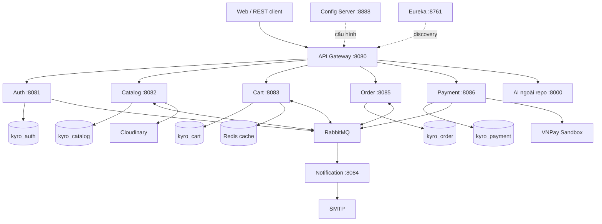
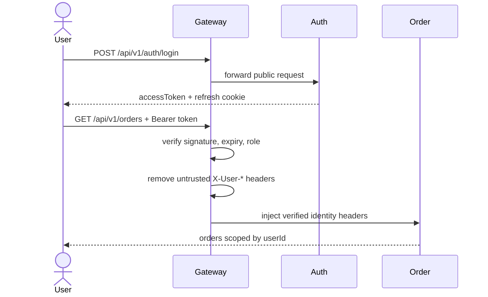

# Tổng quan kiến trúc Kyro Backend

> Nguồn sự thật của tài liệu là source code và Flyway migration trong repository, rà soát ngày 2026-08-17. AI service là hệ thống ngoài repository; các chi tiết nội bộ của AI không được khẳng định nếu không có source tương ứng.

## 1. Bức tranh tổng thể

Repository có 9 Maven module và Compose có 13 container: 9 ứng dụng Java, PostgreSQL, Redis, RabbitMQ và Dozzle. PostgreSQL là một container nhưng chứa database riêng cho từng service. Notification không có database. AI service không được build bởi repository này.

## 2. Trách nhiệm và dữ liệu sở hữu

| Thành phần | Trách nhiệm | Dữ liệu sở hữu |
| --- | --- | --- |
| API Gateway | Route, kiểm tra JWT/role, bỏ header định danh giả, inject `X-User-*`, rate limit/circuit breaker riêng cho AI | Redis dùng cho rate limiter |
| Auth | Đăng ký, OTP, login, refresh cookie, OAuth2, user, role, địa chỉ | `kyro_auth`: `users`, `role`, `address` |
| Catalog | Category, product, variant/SKU, tồn kho, attribute, image, review, thống kê catalog | `kyro_catalog` |
| Cart | Giỏ bền vững, lựa chọn checkout, revalidate giá/tồn kho | `kyro_cart` là source of truth; Redis là cache 30 phút |
| Order | Snapshot checkout, trạng thái đơn, điều phối giữ/hoàn kho, thống kê doanh thu | `kyro_order` |
| Payment | Tạo URL, ký/kiểm tra callback VNPay, lưu transaction | `kyro_payment` |
| Notification | Consume event và gửi email OTP/xác nhận đơn | Không có DB |
| Config Server | Cấp cấu hình tập trung từ `config-server/src/main/resources/config` | File YAML trong repo |
| Eureka | Service registry để Gateway/Feign tìm instance | In-memory registry |

Database-per-service nghĩa là service không join bảng của database khác. Liên hệ chéo chỉ lưu ID/snapshot và lấy dữ liệu qua Feign hoặc event. Ví dụ `order_item.product_id` không có foreign key đến Catalog; địa chỉ trong order là bản chụp, không trỏ về `auth.address`.

## 3. Ba đường giao tiếp phải phân biệt

### Client → Gateway → service

- Client gọi cổng `8080`.
- Route công khai: auth, danh sách/chi tiết product, category, GET review, callback VNPay, AI.
- Route cần đăng nhập gắn `AuthenticationFilter`; admin route yêu cầu claim role `ADMIN`.
- Gateway xác minh JWT, xóa `X-User-Id`, `X-User-Email`, `X-User-Roles`, `X-Internal-Token` do client gửi rồi inject identity từ token.
- Business service chủ yếu tin gateway. Compose không publish port business service ra host, nhưng deployment vẫn phải ngăn client đi vòng qua Gateway.

### Service → service bằng OpenFeign (đồng bộ)

- Caller chờ HTTP response rồi mới tiếp tục.
- Feign dùng tên Eureka như `catalog-service`, không hardcode IP.
- Request nội bộ tự gắn `X-Internal-Token`; `InternalTokenFilter` bảo vệ `/api/v1/internal/**`.
- Shared YAML khai báo connect 2 giây, read 3 giây; cần xác minh property binding bằng runtime config/timeout test trước khi khẳng định giá trị thực thi.
- Dùng khi cần kết quả ngay: địa chỉ, cart/giá, order/amount, quyền review, hoàn stock.

### Service ↔ RabbitMQ (bất đồng bộ)

- Publisher gửi vào exchange; binding route sang queue; HTTP request không chờ consumer.
- Một event đến hai service cần hai queue. `stock.reserved` có `order-saga-queue` và `cart-clear-queue`.
- Dữ liệu giữa các DB chỉ nhất quán cuối cùng.
- Durable queue không đồng nghĩa không mất event: code chưa có publisher confirm, outbox, DLQ hay retry policy rõ ràng.

Xem [RabbitMQ và Feign thực tế](rabbitmq-feign-current-usage.md) và [luồng event](event-driven-flow.md).

## 4. Security và identity

- Access token mặc định 1 giờ; refresh token mặc định 1 ngày và nằm trong cookie.
- Logout chỉ xóa cookie; không có blacklist/revocation server-side.
- OTP là 6 số bằng `SecureRandom`, mặc định hết hạn 10 phút, cooldown resend 1 phút.
- OTP lưu trong `HashMap` của một process: restart làm mất OTP, nhiều instance không chia sẻ OTP, không có giới hạn số lần đoán, và code log OTP ở INFO.
- Shared `INTERNAL_API_TOKEN` là một secret chung, không phải service identity riêng hay mTLS.

## 5. Mô hình dữ liệu đáng nhớ

### Auth

`users` N:1 `role`; `users` 1:N `address`. Email unique. `active` (đã kích hoạt) và `is_banned` là hai cờ khác nhau.

### Catalog

`category` tự tham chiếu parent; `product` N:1 category; product 1:N variant, attribute, image, review. SKU unique; `(product_id, variant_name)` unique; mỗi user chỉ có một review/product.

`minPrice`, `totalStock`, `activeVariantCount`, `averageRating`, `numRatings` là Hibernate `@Formula`, tính từ variant/review. Giá sale tính từ giá variant và discount product.

### Cart

Mỗi user có một cart; `(cart_id, variant_id)` unique. `version` tăng khi cart thay đổi để chống checkout trên snapshot cũ. `processed_cart_events(order_id)` giúp cleanup idempotent.

### Order

Order lưu `user_id`, `user_email`, snapshot địa chỉ và snapshot item gồm product/variant/SKU/tên/ảnh/giá/discount. Snapshot giữ lịch sử khi Catalog đổi. `stock_reserved` theo dõi saga; VNPay order có `expires_at`.

### Payment

Một `payment_details` cho mỗi order (`order_id` unique). Tạo URL mới tái sử dụng row chưa completed và thay `transaction_id`; callback của transaction cũ có thể không còn tìm thấy.

## 6. Trạng thái chính

Order: `PENDING → CONFIRMED → SHIPPED → DELIVERED`, hoặc sang `CANCELLED` theo rule service.

- COD: confirm khi giữ stock thành công; payment thành `COMPLETED` lúc giao hàng.
- VNPay: confirm khi cả `stock_reserved=true` và payment `COMPLETED`.
- VNPay `FAILED` vẫn để order `PENDING` để thanh toán lại đến khi hết hạn.
- Hủy order đã thanh toán không tự refund; payment vẫn `COMPLETED`.

## 7. Tìm kiếm, filter, sort và pagination

| Màn hình | Cách làm hiện tại |
| --- | --- |
| Product | JPA `Specification`; keyword `LIKE %...%` trên title/description/brand; category cha gồm con trực tiếp; brand exact-ignore-case; giá dựa `minPrice`; stock dựa tổng stock variant active; rating từ review |
| Order admin | `Specification`; search orderCode/email/tên/SĐT/tên sản phẩm; filter status/payment/date/total |
| Order customer | Cùng engine nhưng ép `userId` và không nhận search |
| User admin | JPQL search email/firstName/lastName, role, banned + `Pageable` |

Sort whitelist field, page size tối đa 100 và thêm `id` làm tie-breaker. Product parameter `color` đang nhận nhưng chưa dùng. User `status=active` hiện là `banned=false`, không kiểm tra `active=true`.

## 8. Những điều hiện chưa có

- Không distributed transaction/2PC.
- Không transactional outbox/inbox chung, publisher confirm, DLQ hay reconciliation job.
- Không refund VNPay tự động; `vnpay.apiUrl` và enum `REFUNDED` chưa được dùng.
- Không có AI consumer/topology trong repo; chỉ publisher product event và Gateway route tới AI ngoài repo.
- Không full-text search trong Java backend; product search là SQL `LIKE`.
- Notification không có DB/lịch sử gửi email.

## 9. Tài liệu học bảo vệ

- [Sổ tay bảo vệ chi tiết](../defense/defense-handbook.md)
- [Bộ câu hỏi tự luyện](../defense/self-review-questions.md)
- [RabbitMQ và Feign thực tế](rabbitmq-feign-current-usage.md)
- [Luồng event-driven và rủi ro](event-driven-flow.md)
- [Swagger/Scalar](../api/swagger-scalar.md)
