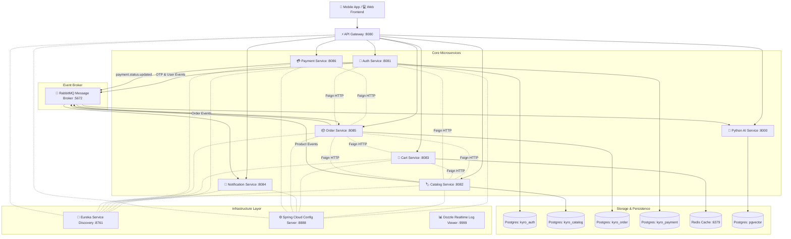
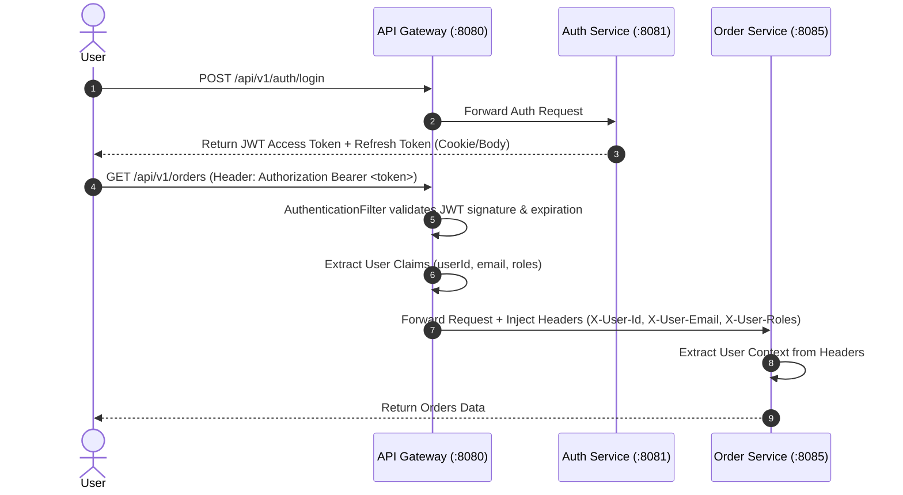

# 🌐 System Architecture Overview

> **Kyro E-Commerce Microservices Platform** được xây dựng theo kiến trúc hướng dịch vụ (SOA / Microservices), kết hợp giữa **Định tuyến tập trung (API Gateway)**, **Đăng ký dịch vụ động (Eureka Discovery)**, **Cấu hình tập trung (Config Server)**, **Giao tiếp đồng bộ (Spring Cloud OpenFeign)**, **Truyền tin bất đồng bộ (RabbitMQ)**, và **Tích hợp AI Vector Recommendation (FastAPI + pgvector + Gemini)**.

---

## 🏛️ 1. Sơ Đồ Kiến Trúc Tổng Quan (System Map)

---

## ⚡ 2. Các Thành Phần Hạ Tầng Chính (Infrastructure Components)

### 1. API Gateway (`:8080`)
- **Nhiệm vụ**: Điểm vào duy nhất (Single Point of Entry) cho mọi HTTP request từ client.
- **Tính năng**:
  - Giải mã và kiểm tra chữ ký JWT Token (`AuthenticationFilter.java`).
  - Trích xuất Claims và inject HTTP Headers định danh: `X-User-Id`, `X-User-Email`, `X-User-Roles`.
  - Định tuyến động (Dynamic Routing) qua Eureka Discovery Server (`lb://AUTH-SERVICE`, `lb://CATALOG-SERVICE`, ...).
  - Quản lý cấu hình Cross-Origin Resource Sharing (CORS) tập trung.

### 2. Eureka Service Discovery (`:8761`)
- **Nhiệm vụ**: Quản lý danh bạ địa chỉ IP/Port của tất cả các microservices Java.
- **Lợi ích**: Giúp các service tự phát hiện và giao tiếp với nhau qua tên service (ví dụ `http://CATALOG-SERVICE`) thay vì hardcode IP.

### 3. Config Server (`:8888`)
- **Nhiệm vụ**: Cung cấp cấu hình tập trung (`resources/config/*.yml`) cho các dịch vụ Java khi khởi động.

### 4. Dozzle Log Viewer (`:9999`)
- **Nhiệm vụ**: Giao diện Web trực quan hiển thị Realtime Logs từ Docker Socket của tất cả 11 container.

---

## 🔄 3. Mô Hình Giao Tiếp Giữa Các Service (Inter-Service Communication)

Hệ thống kết hợp 2 mô hình giao tiếp song song:

### 🅰️ Giao Tiếp Đồng Bộ (Synchronous Feign REST)
Sử dụng **Spring Cloud OpenFeign** cho các giao dịch cần phản hồi tức thì:
- **Order Service -> Catalog Service**: Hoàn tồn kho theo `variantId` khi hủy đơn hợp lệ.
- **Order Service -> Cart Service**: Lấy selection đã được cart revalidate để snapshot SKU, variant và giá khi đặt hàng.
- **Order Service -> Auth Service**: Xác thực thông tin địa chỉ giao hàng (`Address`).
- **Cart Service -> Catalog Service**: Batch revalidate active variant, tồn kho và giá backend khi thêm, cập nhật hoặc checkout.
- **Payment Service -> Order Service**: Kiểm tra trạng thái và số tiền của đơn hàng trước khi tạo link VNPay.

### 🅱️ Giao Tiếp Bất Đồng Bộ (Asynchronous Event-Driven Messaging)
Sử dụng **RabbitMQ Message Broker** (`kyro-rabbitmq:5672`) dựa trên mô hình Publisher-Subscriber:
- **Auth Events**: Phát `otp.email.queue` khi có yêu cầu đăng ký/quên mật khẩu -> `notification-service` tiêu thụ để gửi email.
- **Order Events**: Phát `order.created.queue` -> `notification-service` gửi mail xác nhận đơn hàng cho khách.
- **Product Events**: `catalog-service` phát sự kiện biến động sản phẩm (`product.events`) -> `ai-service` tiêu thụ để tự động cập nhật vector embeddings trong database `pgvector`.

---

## 🗄️ 4. Phân Tách Dữ Liệu (Database-per-service Principle)

Mỗi dịch vụ sở hữu cơ sở dữ liệu riêng độc lập, không truy cập chéo database của nhau:

| Microservice | Loại CSDL / Engine | Tên Database / Namespace | Nhiệm Vụ |
| :--- | :--- | :--- | :--- |
| **Auth Service** | PostgreSQL 16 | `kyro_auth` | Lưu Role, User, Address |
| **Catalog Service** | PostgreSQL 16 | `kyro_catalog` | Lưu Category, Product, ProductVariant/SKU, ProductAttribute, Image và Review |
| **Order Service** | PostgreSQL 16 | `kyro_order` | Lưu Orders, OrderItems và snapshot địa chỉ giao hàng |
| **Payment Service** | PostgreSQL 16 | `kyro_payment` | Lưu transaction và VNPay callback data |
| **Cart Service** | PostgreSQL 16 + Redis 7 | `kyro_cart` + `kyro-redis` | PostgreSQL là source of truth; Redis cache snapshot giỏ hàng với TTL 30 phút |
| **AI Service** | PostgreSQL 16 | `pgvector` (`postgres`) | Vector embeddings 768 chiều & Product Index |

---

## 🔒 5. Kiến Trúc Bảo Mật & Luồng Request (Security Architecture)

---

## 📊 6. Tích Hợp AI Vector Search & Recommendation

- **Tech Stack**: Python 3.11, FastAPI, SQLAlchemy, Alembic, Google Gemini API (`models/embedding-001`), PostgreSQL `pgvector`.
- **Luồng hoạt động**:
  1. Khi Admin thêm/sửa sản phẩm ở `catalog-service`, một message chứa thông tin sản phẩm được gửi lên RabbitMQ exchange.
  2. `ai-service` lắng nghe message, trích xuất text (tên, mô tả, danh mục, giá) và gọi Gemini API sinh Vector Embedding 768 chiều.
  3. Vector được lưu vào Postgres `pgvector`.
  4. Người dùng gọi API gợi ý sản phẩm gợi ý semantic search -> `ai-service` thực hiện tính khoảng cách Vector Cosine Similarity trên CSDL để trả về top sản phẩm liên quan nhất.
