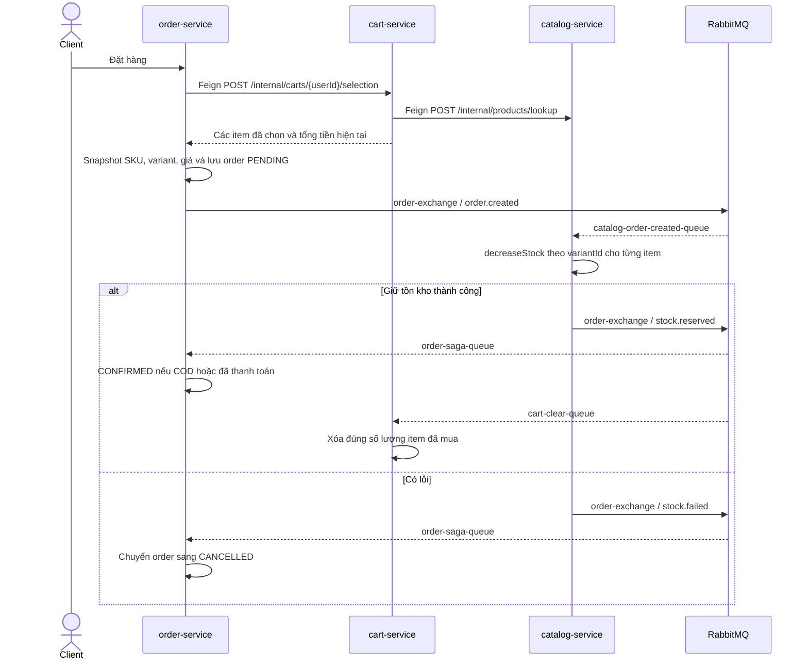

# RabbitMQ và OpenFeign đang được sử dụng như thế nào?

Tài liệu này phản ánh **source code hiện tại tại ngày 2026-08-17**. Mục tiêu là chỉ ra nơi RabbitMQ và OpenFeign thực sự được gọi, dữ liệu đi qua đâu, và phần nào phụ thuộc hệ thống ngoài repository.

## Tóm tắt

| Công nghệ | Cách dùng hiện tại | Service tham gia |
| --- | --- | --- |
| RabbitMQ | Giao tiếp bất đồng bộ cho OTP, saga giữ tồn kho/xóa sản phẩm khỏi giỏ, đồng bộ trạng thái thanh toán và phát sự kiện sản phẩm cho AI | `auth`, `notification`, `order`, `catalog`, `cart`, `payment` |
| OpenFeign | Gọi HTTP đồng bộ khi kết quả của service khác cần có ngay để xử lý request hiện tại | `cart -> catalog`, `catalog -> auth/order`, `order -> auth/cart/catalog`, `payment -> order` |

RabbitMQ chạy tại `kyro-rabbitmq:5672`; giao diện quản trị được expose tại `localhost:15672`. OpenFeign tìm service theo tên qua Eureka, không hardcode host/port.

## 1. RabbitMQ

### 1.1. Các exchange, routing key và queue thực tế

| Publisher | Exchange (topic) | Routing key | Queue | Consumer | Trạng thái |
| --- | --- | --- | --- | --- | --- |
| `auth-service` | `notification-exchange` | `notification.otp` | `otp-queue` | `notification-service` | Đang dùng |
| `order-service` | `order-exchange` | `order.created` | `catalog-order-created-queue` | `catalog-service` | Đang dùng |
| `catalog-service` | `order-exchange` | `stock.reserved` | `order-saga-queue` | `order-service` | Đang dùng |
| `catalog-service` | `order-exchange` | `stock.reserved` | `cart-clear-queue` | `cart-service` | Đang dùng |
| `catalog-service` | `order-exchange` | `stock.failed` | `order-saga-queue` | `order-service` | Đang dùng |
| `payment-service` | `payment-exchange` | `payment.status.updated` | `order-payment-status-queue` | `order-service` | Đang dùng |
| `order-service` | `notification-exchange` | `notification.order` | `order-queue` | `notification-service` | Gửi khi order lần đầu thành `CONFIRMED` |
| `order-service` | `order-exchange` | `order.delivered` | `catalog-order-delivered-queue` | `catalog-service` | Cộng `quantity_sold`, có idempotency theo orderId |
| `catalog-service` | `product.events` | `product.created`, `product.updated`, `product.deleted` | `ai.product.events` theo comment | AI service ngoài repo này | Publisher đang được gọi; topology consumer không có trong repo |

Các queue do Java service khai báo đều là durable. Message được serialize/deserialize bằng `Jackson2JsonMessageConverter`.

### 1.2. Luồng đặt hàng và giữ tồn kho



Điểm gọi cụ thể:

- [`OrderService.placeOrder`](../../order-service/src/main/java/com/kyro/order/OrderService.java) lưu order rồi publish `OrderCreatedEvent(orderId, userId, userEmail, items)` với routing key `order.created`.
- [`catalog OrderEventListener`](../../catalog-service/src/main/java/com/kyro/catalog/messaging/OrderEventListener.java) đọc `catalog-order-created-queue`, trừ tồn kho và publish `stock.reserved` hoặc `stock.failed`.
- [`order OrderSagaEventListener`](../../order-service/src/main/java/com/kyro/order/messaging/OrderSagaEventListener.java) đọc kết quả giữ tồn kho để xác nhận hoặc hủy order.
- [`cart OrderEventListener`](../../cart-service/src/main/java/com/kyro/cart/messaging/OrderEventListener.java) cũng nhận `stock.reserved` nhưng qua queue riêng, sau đó xóa các item đã mua khỏi cart. Đây là cơ chế đang thay cho `CartClient.clearCart()`.

### 1.3. Luồng thanh toán VNPay

```mermaid
sequenceDiagram
    participant VNPay
    participant Payment as payment-service
    participant Rabbit as RabbitMQ
    participant Order as order-service

    VNPay->>Payment: Callback kết quả thanh toán
    Payment->>Payment: Lưu COMPLETED hoặc FAILED
    Payment->>Rabbit: Sau DB commit: payment.status.updated
    Rabbit-->>Order: order-payment-status-queue
    Order->>Order: Cập nhật paymentStatus; COMPLETED => CONFIRMED
```

- [`PaymentService.saveAndPublishStatus`](../../payment-service/src/main/java/com/kyro/payment/PaymentService.java) phát Spring application event sau khi lưu kết quả callback.
- [`PaymentStatusEventPublisher`](../../payment-service/src/main/java/com/kyro/payment/messaging/PaymentStatusEventPublisher.java) chỉ publish sang RabbitMQ ở pha `AFTER_COMMIT`, nên consumer không thấy trạng thái chưa commit.
- [`PaymentStatusEventListener`](../../order-service/src/main/java/com/kyro/order/messaging/PaymentStatusEventListener.java) nhận `{orderId, status}` và gọi `OrderService.updatePaymentStatus`.

`FAILED` không hủy order ngay: order vẫn `PENDING`, có thể giữ stock và cho thanh toán lại. Scheduler Order hủy/hoàn stock sau TTL 15 phút cộng grace callback 5 phút. Late success sau khi order đã hủy bị Order bỏ qua; Payment có thể `COMPLETED` trong khi Order `CANCELLED`, khi đó phải refund thủ công. Source chưa có VNPay refund API; config `vnpay.apiUrl` và enum `REFUNDED` chưa được sử dụng.

### 1.4. Luồng gửi OTP

1. Đăng ký hoặc resend OTP gọi [`OtpService.sendOtpEmail`](../../auth-service/src/main/java/com/kyro/auth/security/otp/OtpService.java).
2. `auth-service` publish payload `{email, otp, expirationMinutes}` vào `notification-exchange` với routing key `notification.otp`.
3. [`NotificationListener.receiveOtpNotification`](../../notification-service/src/main/java/com/kyro/notification/listener/NotificationListener.java) đọc `otp-queue` và gọi `EmailService.sendOtpEmail`.

`notification-service` là nơi khai báo `notification-exchange`, `otp-queue`, `order-queue` và các binding tương ứng.

### 1.5. Sự kiện đồng bộ sản phẩm sang AI

[`ProductService`](../../catalog-service/src/main/java/com/kyro/catalog/ProductService.java) gọi [`ProductEventPublisher`](../../catalog-service/src/main/java/com/kyro/catalog/messaging/ProductEventPublisher.java) sau các thao tác:

- Tạo sản phẩm: `product.created` / `ProductCreated`.
- Sửa sản phẩm: `product.updated` / `ProductUpdated`.
- Xóa sản phẩm: `product.deleted` / `ProductDeleted`.

Payload có envelope `event_id`, `event_type`, `occurred_at`, `data`; phần `data` chứa thông tin dùng để cập nhật search/vector index. Repo backend này không có AI consumer hoặc bean khai báo exchange/queue cho luồng này. Comment trong publisher kỳ vọng AI service lắng nghe queue `ai.product.events`; vì vậy cần kiểm tra topology ở repo AI hoặc cấu hình RabbitMQ trước khi coi luồng end-to-end là hoạt động.

### 1.6. Phần RabbitMQ chưa hoạt động và giới hạn hiện tại

- Order chỉ publish `notification.order` khi lần đầu chuyển từ `PENDING` sang `CONFIRMED`, không phải lúc vừa tạo. COD chờ giữ stock; VNPay chờ cả giữ stock và payment `COMPLETED`.
- Không tìm thấy cấu hình DLQ, dead-letter exchange, retry policy hoặc manual acknowledgement trong source hiện tại. Listener đang dùng acknowledgement mặc định của Spring AMQP.
- `NotificationListener` bắt exception và không ném lại; lỗi gửi mail vì thế không kích hoạt redelivery theo listener container.
- Publish `order.created` bị bắt lỗi sau khi order đã lưu; RabbitMQ lỗi có thể để order ở `PENDING` mà không có event xử lý tồn kho.
- Publish trạng thái payment chạy `AFTER_COMMIT` nhưng chưa có transactional outbox; DB commit thành công rồi broker lỗi vẫn có thể mất event.
- Cart consumer có chặn xử lý lặp bằng `ProcessedCartEvent(orderId)`. Order có row lock và state-transition guard nhưng không có inbox/event ID; Catalog reserve chưa có idempotency nên `order.created` giao lại vẫn có thể trừ stock nhiều lần.
- `catalog-service` trừ stock tuần tự nhưng toàn bộ `reserveStock` chạy trong một transaction và dùng pessimistic lock; item sau lỗi làm transaction rollback toàn bộ. Rủi ro thật là event `order.created` giao lại có thể chạy transaction trừ stock thêm lần nữa vì chưa có idempotency.
- Nếu Catalog commit trừ stock rồi publish `stock.reserved` lỗi, catch thử phát `stock.failed`. Lần hai cũng có thể mất; nếu gửi được thì Order bị hủy dù stock đã giảm. Không có outbox/reconciliation để khép failure window này.
- `order.delivered` có idempotency phía Catalog, nhưng publisher vẫn có thể mất event sau commit nên `quantity_sold` có thể thấp hơn dữ liệu Order.

## 2. OpenFeign

### 2.1. Cơ chế chung

- `cart-service`, `catalog-service`, `order-service`, `payment-service` bật Feign bằng `@EnableFeignClients`.
- `@FeignClient(name = "...")` dùng tên đăng ký Eureka để chọn instance.
- Mỗi caller gắn header `X-Internal-Token` bằng `RequestInterceptor`; các endpoint `/api/v1/internal/**` ở service nhận kiểm tra token này.
- Config Server khai báo timeout mặc định: connect `2000 ms`, read `3000 ms`.
- Config Server bật Feign circuit breaker, nhưng trong các service gọi Feign chỉ `order-service` khai báo dependency circuit breaker. Cũng chỉ client `order-service -> auth-service` có fallback; fallback trả `null`, sau đó luồng đặt hàng báo địa chỉ không hợp lệ.
- Đây là lời gọi đồng bộ: request phía người dùng phải chờ Feign trả về hoặc lỗi.

### 2.2. Các lời gọi đang dùng

| Caller | Feign client / API đích | Nơi gọi và mục đích |
| --- | --- | --- |
| `cart-service` | `CatalogClient.getProductById` — `GET /api/v1/internal/products/{productId}` | [`CartService`](../../cart-service/src/main/java/com/kyro/cart/service/CartService.java) xác minh `variantId`, active, giá và tồn kho khi thêm/cập nhật cart item |
| `cart-service` | `CatalogClient.getProducts` — `POST /api/v1/internal/products/lookup` | Batch refresh variant và snapshot giá cho cả cart hoặc selection, tránh N+1 |
| `catalog-service` | `UserClient.getUserById` — `GET /api/v1/internal/users/{userId}` | [`ReviewController`](../../catalog-service/src/main/java/com/kyro/catalog/ReviewController.java) lấy tên người dùng khi tạo review |
| `catalog-service` | `OrderClient.hasPurchasedAndDelivered` — `GET /api/v1/internal/orders/purchases` | [`ReviewService`](../../catalog-service/src/main/java/com/kyro/catalog/ReviewService.java) kiểm tra user đã nhận sản phẩm trước khi review |
| `catalog-service` | `OrderClient.getTopSellingProducts` — `GET /api/v1/internal/orders/top-selling` | [`ProductService`](../../catalog-service/src/main/java/com/kyro/catalog/ProductService.java) lấy số lượng bán rồi ghép với dữ liệu catalog cho admin analytics |
| `catalog-service` | `OrderClient.getProductRevenue` — `GET /api/v1/internal/orders/product-revenue` | Lấy aggregate doanh thu của toàn bộ product bằng một batch call cho analytics category |
| `order-service` | `CartClient.getSelection` — `POST /api/v1/internal/carts/{userId}/selection` | Lấy đúng các cart item user chọn, version và tổng tiền để kiểm tra checkout |
| `order-service` | `UserClient.getAddressById` — `GET /api/v1/internal/users/{userId}/addresses/{addressId}` | Xác minh địa chỉ thuộc user và snapshot địa chỉ vào order |
| `order-service` | `CatalogClient.adjustStock` — `PATCH /api/v1/internal/products/variants/{variantId}/stock` | Hoàn lại tồn kho đúng SKU khi hủy order `PENDING` hoặc `CONFIRMED` |
| `payment-service` | `OrderClient.getOrderById` — `GET /api/v1/internal/orders/{id}` | Kiểm tra ownership, method/status/expiry và lấy tổng tiền; endpoint tạo payment hiện gọi API này hai lần (controller rồi service), endpoint đọc payment gọi một lần |

Interface tương ứng nằm tại:

- [`cart-service CatalogClient`](../../cart-service/src/main/java/com/kyro/cart/client/CatalogClient.java)
- [`catalog-service OrderClient`](../../catalog-service/src/main/java/com/kyro/catalog/client/OrderClient.java) và [`UserClient`](../../catalog-service/src/main/java/com/kyro/catalog/client/UserClient.java)
- [`order-service CartClient`](../../order-service/src/main/java/com/kyro/order/client/CartClient.java), [`CatalogClient`](../../order-service/src/main/java/com/kyro/order/client/CatalogClient.java), [`UserClient`](../../order-service/src/main/java/com/kyro/order/client/UserClient.java)
- [`payment-service OrderClient`](../../payment-service/src/main/java/com/kyro/payment/client/OrderClient.java)

### 2.3. Method Feign đã khai báo nhưng không được gọi

Trong `order-service`, hai method sau của `CartClient` không có caller:

- `getCart(userId)`
- `clearCart(userId)`

Luồng checkout chỉ dùng `getSelection(...)`; việc xóa item sau khi giữ stock thành công được thực hiện bất đồng bộ qua RabbitMQ `stock.reserved`.

## 3. Khi nào hệ thống dùng Feign, khi nào dùng RabbitMQ?

| Nhu cầu | Cách đang dùng | Lý do |
| --- | --- | --- |
| Cần dữ liệu ngay để quyết định request hiện tại: cart selection, địa chỉ, giá, quyền review, tổng tiền thanh toán | Feign | Caller không thể tiếp tục nếu chưa có response |
| Công việc có thể xử lý sau: gửi OTP | RabbitMQ | Không giữ request chờ SMTP |
| Một sự kiện cần nhiều consumer độc lập: `stock.reserved` vừa cập nhật order vừa dọn cart | RabbitMQ với queue riêng cho từng consumer | Mỗi queue nhận một bản sao của event |
| Đồng bộ trạng thái sau khi transaction payment commit | RabbitMQ | Tách payment DB khỏi order DB |
| Hủy order cần biết hoàn stock thành công hay thất bại ngay trong transaction hiện tại | Feign | Code hiện tại thực hiện đồng bộ |

## 4. File cấu hình chính

- Hạ tầng RabbitMQ và biến môi trường: [`compose.yml`](../../compose.yml)
- Eureka, timeout và circuit breaker Feign: [`config/application.yml`](../../config-server/src/main/resources/config/application.yml)
- RabbitMQ theo service: [`auth-service.yml`](../../config-server/src/main/resources/config/auth-service.yml), [`cart-service.yml`](../../config-server/src/main/resources/config/cart-service.yml), [`catalog-service.yml`](../../config-server/src/main/resources/config/catalog-service.yml), [`order-service.yml`](../../config-server/src/main/resources/config/order-service.yml), [`payment-service.yml`](../../config-server/src/main/resources/config/payment-service.yml), [`notification-service.yml`](../../config-server/src/main/resources/config/notification-service.yml)
