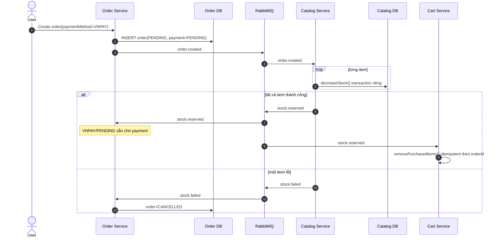
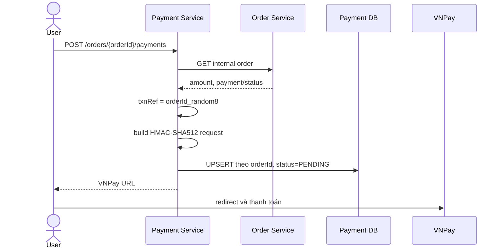
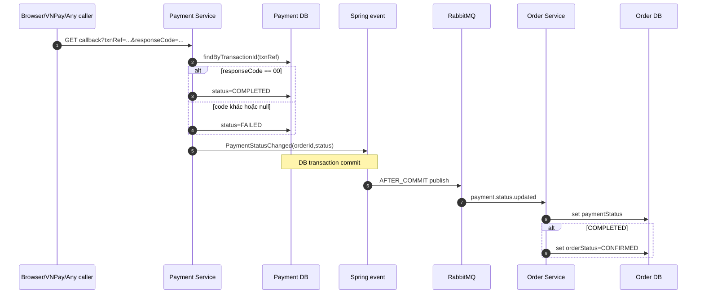

# Luồng hiện tại và các ranh giới nhất quán

## 1. Các nguồn dữ liệu đang tồn tại

Hệ thống lưu cùng một sự thật nghiệp vụ ở nhiều nơi:

| Hệ thống | Dữ liệu liên quan | Có thể coi là nguồn chuẩn cho gì? |
|---|---|---|
| VNPay | Kết quả giao dịch, mã giao dịch VNPay, trạng thái refund | Kết quả chuyển tiền bên ngoài hệ thống |
| Payment PostgreSQL | `payment_details.payment_status`, `transaction_id`, amount, callback log | Ledger nội bộ hiện tại, nhưng chỉ có một row cho mỗi order |
| Order PostgreSQL | `orders.payment_status`, `orders.order_status` | Trạng thái fulfillment mà ứng dụng hiển thị/xử lý |
| Catalog PostgreSQL | tồn kho theo size, `quantitySold` | Tình trạng giữ/trừ hàng |
| RabbitMQ | event đang chờ hoặc đang xử lý | Kênh truyền thay đổi, không phải nguồn sự thật lâu dài |
| Cart PostgreSQL/Redis | giỏ hàng và `processed_cart_events` | Trạng thái giỏ sau khi giữ hàng |

Điểm quan trọng: “Payment DB và Order DB giống nhau” vẫn chưa đủ. Cả hai có thể cùng sai so với VNPay nếu callback không được xác thực.

## 2. Luồng tạo đơn và giữ hàng



Bằng chứng:

- Order khởi tạo `orderStatus=PENDING` và `paymentStatus=PENDING`: [`OrderService.java` dòng 273–286](../../../order-service/src/main/java/com/kyro/order/OrderService.java#L273).
- `order.created` được publish trực tiếp và exception chỉ bị log rồi bỏ qua: [`OrderService.java` dòng 329–347](../../../order-service/src/main/java/com/kyro/order/OrderService.java#L329).
- Catalog trừ từng item rồi mới phát `stock.reserved`; khi lỗi phát `stock.failed`: [`OrderEventListener.java` dòng 37–82](../../../catalog-service/src/main/java/com/kyro/catalog/messaging/OrderEventListener.java#L37).
- Mỗi `decreaseStock()` có transaction riêng và lock product: [`ProductService.java` dòng 535–560](../../../catalog-service/src/main/java/com/kyro/catalog/ProductService.java#L535).
- Cart có idempotency bằng `processed_cart_events(orderId)`: [`CartService.java` dòng 126–139](../../../cart-service/src/main/java/com/kyro/cart/service/CartService.java#L126). Đây là pattern tốt đã có sẵn trong repo và có thể tái sử dụng về mặt ý tưởng.

### Ranh giới lỗi đầu tiên

Order DB commit và RabbitMQ publish không nằm trong một transaction nguyên tử. Nếu publish `order.created` lỗi, exception bị nuốt, API vẫn có thể trả order đã tạo nhưng không có tiến trình giữ hàng. Đây là cùng một lớp lỗi dual-write với payment event.

### Partial stock deduction

Listener Catalog gọi `decreaseStock()` lần lượt. Vì lời gọi đi qua bean `ProductService`, mỗi item commit transaction riêng. Nếu item thứ nhất thành công và item thứ hai thất bại, `stock.failed` được phát nhưng code không hoàn lại item thứ nhất. Tên comment “compensation event” không đồng nghĩa đã có compensation thực tế.

## 3. Luồng tạo payment URL



Các chi tiết quan trọng:

1. Controller nhận `X-User-Id` nhưng không so sánh với `order.userId`; comment nói đang “assume”: [`PaymentController.java` dòng 35–59](../../../payment-service/src/main/java/com/kyro/payment/PaymentController.java#L35).
2. Service không chặn order không phải VNPAY, order đã `CANCELLED`, `DELIVERED`, hoặc payment đã `COMPLETED`.
3. Mỗi lần gọi tạo link, code tìm payment theo `orderId`, đặt lại `PENDING`, tạo `transactionId` mới rồi ghi đè: [`PaymentService.java` dòng 102–115](../../../payment-service/src/main/java/com/kyro/payment/PaymentService.java#L102).
4. Schema cưỡng chế unique `order_id`, tức một order chỉ giữ được một payment attempt: [`V1__init.sql` dòng 1–17](../../../payment-service/src/main/resources/db/migration/V1__init.sql#L1).
5. `transaction_id` không có unique constraint. Random 8 chữ số giảm xác suất trùng nhưng DB không bảo vệ invariant.

Request sang VNPay được ký HMAC-SHA512. Đây là phần đúng, nhưng chữ ký request gửi đi không thay thế việc kiểm chữ ký response nhận về.

## 4. Return URL, IPN và endpoint hiện tại

Theo tài liệu VNPay:

- `vnp_ReturnUrl`: redirect trình duyệt để hiển thị kết quả cho khách.
- IPN URL: VNPay server gọi merchant server để merchant xác minh và cập nhật DB; mục tiêu là không phụ thuộc kết nối/trình duyệt khách.

Trong repo:

- `vnpay.returnUrl` mặc định là `http://localhost:5173/checkout?step=4`, tức frontend: [`payment-service.yml` dòng 28–33](../../../config-server/src/main/resources/config/payment-service.yml#L28).
- Backend có một endpoint public tên `/payment-providers/vnpay/callback`: [`PaymentController.java` dòng 66–97](../../../payment-service/src/main/java/com/kyro/payment/PaymentController.java#L66).
- Gateway expose endpoint này không cần authentication: [`api-gateway.yml` dòng 101–107](../../../config-server/src/main/resources/config/api-gateway.yml#L101).
- Không có endpoint `ipn`, cấu hình `ipnUrl`, hay handler trả JSON theo hợp đồng `RspCode`/`Message` trong repo.

Không thể kết luận từ repo rằng production chắc chắn không khai báo IPN ở VNPay Merchant Portal. Có thể có cấu hình ngoài repo. Nhưng handler hiện tại vẫn chưa đủ để làm IPN chuẩn.

## 5. Luồng callback hiện tại



Handler **không thực hiện** các kiểm tra sau:

- Không tính lại và so sánh `vnp_SecureHash`.
- Không so sánh `vnp_Amount / 100` với `payment.totalAmount`.
- Không so sánh `vnp_TmnCode` với merchant hiện tại.
- Không yêu cầu cả `vnp_ResponseCode == 00` và `vnp_TransactionStatus == 00`.
- Không lưu/unique `vnp_TransactionNo`.
- Không kiểm payment hiện đang `PENDING` trước khi chuyển trạng thái.
- Không phân biệt duplicate callback với callback mới.

Bằng chứng nằm tại [`PaymentService.java` dòng 161–195](../../../payment-service/src/main/java/com/kyro/payment/PaymentService.java#L161).

Controller và service còn diễn giải input khác nhau: service chỉ đọc `vnp_ResponseCode`, nên thiếu field này sẽ ghi `FAILED`; controller lại fallback sang `vnp_TransactionStatus` để tạo response. Với request chỉ có `vnp_TransactionStatus=00`, DB có thể là `FAILED` nhưng HTTP body lại báo `success=true`: [`PaymentController.java` dòng 74–96](../../../payment-service/src/main/java/com/kyro/payment/PaymentController.java#L74).

VNPay yêu cầu kiểm checksum **trước**, sau đó kiểm order tồn tại, amount và trạng thái để tránh xử lý lặp; xem [hướng dẫn IPN chính thức](https://sandbox.vnpayment.vn/apis/docs/thanh-toan-pay/pay.html).

## 6. Ranh giới DB commit → RabbitMQ

`PaymentStatusEventPublisher` dùng `@TransactionalEventListener(AFTER_COMMIT)`: [`PaymentStatusEventPublisher.java` dòng 23–30](../../../payment-service/src/main/java/com/kyro/payment/messaging/PaymentStatusEventPublisher.java#L23).

Điều này đảm bảo không phát event nếu transaction Payment DB rollback. Nó **không** đảm bảo chiều còn lại:

```text
Payment DB COMMIT ───── cửa sổ crash/network/no-route ───── RabbitMQ nhận event
                     ^
                     DB đã không thể rollback
```

Config chỉ có host/port/user/password, không thấy publisher confirm, publisher return/mandatory hoặc retry: [`payment-service.yml` dòng 22–26](../../../config-server/src/main/resources/config/payment-service.yml#L22).

Theo Spring AMQP, publish là asynchronous; message không route mặc định có thể bị RabbitMQ drop. Theo RabbitMQ, reliable publishing cần publisher confirms, và duplicate vẫn có thể xảy ra khi retry nên consumer phải idempotent.

## 7. Consumer Order hiện tại

Event chỉ gồm hai field:

```java
record PaymentStatusChangedEvent(Long orderId, String status) {}
```

Nó không có `eventId`, `paymentAttemptId`, `transactionId`, `occurredAt`, sequence/version hoặc amount. Consumer vì vậy không thể biết:

- event đã xử lý chưa;
- event nào mới hơn;
- event thuộc payment attempt nào;
- status có khớp amount/transaction đã biết không.

Consumer gọi thẳng `updatePaymentStatus`: [`PaymentStatusEventListener.java` dòng 23–30](../../../order-service/src/main/java/com/kyro/order/messaging/PaymentStatusEventListener.java#L23). Hàm này set status vô điều kiện, và cứ `COMPLETED` là set order `CONFIRMED`: [`OrderService.java` dòng 575–583](../../../order-service/src/main/java/com/kyro/order/OrderService.java#L575).

Trong khi đó stock consumer cũng ghi `orderStatus` độc lập: [`OrderSagaEventListener.java` dòng 25–48](../../../order-service/src/main/java/com/kyro/order/messaging/OrderSagaEventListener.java#L25). Entity `Order` không có `@Version`, nên hai consumer chạy đồng thời không có optimistic concurrency guard.

## 8. Invariant nghiệp vụ nên có

Các invariant tối thiểu để đánh giá mọi giải pháp:

```text
I1. Chỉ source đã xác thực từ VNPay mới được xác nhận tiền đã thu.
I2. Payment COMPLETED chỉ khi checksum, merchant, txnRef, amount,
    responseCode và transactionStatus đều hợp lệ.
I3. Order CONFIRMED với VNPAY chỉ khi:
    payment == COMPLETED AND stock == RESERVED.
I4. Order CANCELLED + payment COMPLETED phải sinh refund workflow thật;
    không được tự ghi REFUNDED trước khi VNPay xác nhận.
I5. Terminal state không bị event cũ làm lùi hoặc hồi sinh.
I6. Mỗi payment attempt được giữ lịch sử riêng; callback gắn đúng attempt.
I7. Mọi thay đổi đã commit cần cuối cùng được chuyển tiếp hoặc đối soát.
I8. Xử lý duplicate phải cho cùng kết quả và không lặp side effect.
```

Code hiện tại vi phạm hoặc chưa đủ dữ liệu để bảo đảm cả tám invariant.
