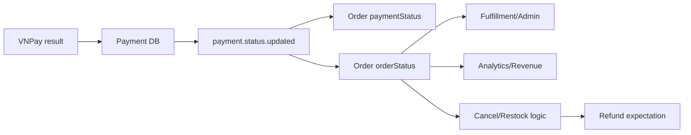

# Phân tích lỗi và race condition

## 1. Cách đọc ma trận

- **Đã chứng minh**: đường code gây ra trạng thái này tồn tại trực tiếp trong repo.
- **Phụ thuộc runtime**: cần broker/network/config ngoài repo để tái hiện, nhưng code không có cơ chế bảo vệ.
- **Ảnh hưởng**:
  - Critical: có thể mất tiền/giao hàng sai/gian lận.
  - High: lệch dữ liệu không tự hồi phục hoặc phá luồng đơn.
  - Medium: audit, vận hành hoặc trải nghiệm sai nhưng có đường xử lý thủ công.

## 2. Ma trận failure mode

| ID | Failure mode | Trạng thái cuối có thể xảy ra | Mức | Cơ chế hồi phục hiện có |
|---|---|---|---|---|
| F01 | Giả callback với `responseCode=00` | Payment `COMPLETED`, Order `CONFIRMED`, VNPay không có giao dịch | Critical | Không |
| F02 | Callback amount khác amount order | Hệ thống xác nhận sai số tiền | Critical | Không |
| F03 | `responseCode=00` nhưng `transactionStatus!=00` | Hệ thống vẫn xác nhận thành công | Critical | Không |
| F04 | Khách thanh toán nhưng đóng tab/mất mạng trước Return URL | VNPay success, nội bộ `PENDING` | Critical | Không thấy IPN/queryDR job trong repo |
| F05 | Payment DB commit, service crash trước publish | Payment `COMPLETED`, Order `PENDING` | Critical | Không có outbox |
| F06 | Publish tới exchange nhưng không có binding/queue | Event bị drop, Order `PENDING` | High | Không thấy mandatory/return |
| F07 | RabbitMQ/network tạm lỗi | Payment commit nhưng event không chắc được broker nhận | High | Không thấy persistent retry/confirm |
| F08 | Duplicate callback success | Event được phát nhiều lần | Medium→Critical | Set cùng status gần-idempotent, nhưng có thể hồi sinh order terminal |
| F09 | Success rồi callback failure đến sau | Payment và Order từ `COMPLETED` thành `FAILED` | Critical | Không có transition guard/version |
| F10 | Failure rồi success đến sau | Có thể hội tụ success, nhưng side effect failure trước đó không được bù | High | Không |
| F11 | `stock.failed` rồi payment success | Order `CANCELLED` bị đổi thành `CONFIRMED` | Critical | Không |
| F12 | payment success rồi `stock.failed` | Order `CANCELLED`, Payment DB vẫn `COMPLETED`, chưa refund | Critical | Không |
| F13 | Payment failed sau khi stock reserved | Order `PENDING/FAILED`, stock đã trừ, cart đã xóa | High | Chỉ khi ai đó hủy order thủ công mới có thể restock |
| F14 | Payment hết hạn nhưng không callback | Payment/Order `PENDING`, stock bị giữ vô hạn | High | Không thấy expiry job |
| F15 | Tạo payment URL lần hai | Attempt cũ bị ghi đè bằng txnRef mới và reset `PENDING` | Critical | Không |
| F16 | Callback attempt cũ đến sau lần tạo link mới | `findByTransactionId` không thấy giao dịch, dù tiền có thể đã thu | Critical | Không |
| F17 | Hai callback cạnh tranh | Last writer wins; kết quả phụ thuộc timing | Critical | Không lock/version/conditional update |
| F18 | Hủy order đã thanh toán | Order ghi `REFUNDED`, Payment vẫn `COMPLETED`, VNPay chưa được gọi refund | Critical | Không thấy refund API implementation |
| F19 | Một item stock fail sau các item trước đã commit | Order canceled nhưng tồn kho một phần đã bị trừ | High | Không có compensation các item trước |
| F20 | `order.created` publish lỗi | Order tồn tại nhưng không reserve stock/clear cart | High | Exception bị nuốt, không outbox |
| F21 | Consumer Payment nhận status lạ | Exception bị bắt và message có thể được xem là xử lý xong | Medium | Chỉ log |
| F22 | Consumer lỗi lặp vĩnh viễn | Requeue/poison-message behavior phụ thuộc default/runtime | High | Không thấy retry/DLQ trong source |
| F23 | Người khác tạo payment URL cho order không thuộc mình | Payment attempt của order bị reset/thay txnRef | Critical | Header có nhưng không verify ownership |
| F24 | Tra cứu payment của order không thuộc mình | Lộ payment log/transaction metadata | High | Không verify `userId == order.userId` |
| F25 | Thiếu `vnp_ResponseCode` nhưng `vnp_TransactionStatus=00` | Payment DB ghi `FAILED` nhưng HTTP body báo `success=true` | High | Không |

## 3. Timeline cụ thể: giả mạo callback

Endpoint callback là public ở API Gateway và mọi request tới Payment Service được `permitAll`. Public là đúng đối với IPN, nhưng tính xác thực phải đến từ HMAC; hiện không có bước đó.

```text
T0  Kẻ gọi biết/đoán txnRef đang PENDING, ví dụ 42_12345678.
T1  GET /api/v1/payment-providers/vnpay/callback
      ?vnp_TxnRef=42_12345678
      &vnp_ResponseCode=00
T2  Payment Service tìm thấy row theo txnRef.
T3  Không kiểm secureHash/amount/tmnCode/transactionStatus.
T4  Payment DB = COMPLETED.
T5  payment.status.updated(COMPLETED) được phát.
T6  Order DB = payment COMPLETED, order CONFIRMED.
```

Request thậm chí không cần có `vnp_SecureHash`, `vnp_Amount` hay `vnp_TransactionNo`. Vì vậy đây là lỗ hổng integrity có đường khai thác trực tiếp, không phải rủi ro xác suất thấp do distributed systems.

## 4. Timeline: đã thu tiền nhưng Order không biết

### Trường hợp A — mất Return URL

```text
VNPay/Ngân hàng: SUCCESS
        |
        X  trình duyệt đóng, redirect lỗi, frontend không forward callback
        |
Payment DB: PENDING
Order DB:   PENDING
Stock:      RESERVED
Cart:       CLEARED
```

VNPay nói rõ IPN tồn tại để tránh phụ thuộc kết nối của khách. Nếu production không có IPN riêng, kết quả này không tự hội tụ.

### Trường hợp B — dual-write gap

```text
T0 callback hợp lệ/được chấp nhận
T1 UPDATE payment_details SET status='COMPLETED'
T2 COMMIT Payment DB
T3 process crash hoặc broker publish thất bại
T4 không có row outbox để retry

Kết quả:
VNPay       SUCCESS
Payment DB  COMPLETED
Order DB    PENDING
```

`AFTER_COMMIT` đóng cửa sổ “event phát rồi DB rollback”, nhưng tạo rõ cửa sổ “DB commit rồi event mất”. Transaction database không thể rollback chỉ vì RabbitMQ send sau đó thất bại.

### Trường hợp C — unroutable nhưng không báo lỗi

Nếu `payment-exchange` tồn tại nhưng queue/binding của Order Service chưa được declare, publish có thể thành công ở mức gửi tới exchange nhưng message không tới queue nào. Spring AMQP nêu rõ message không route mặc định bị drop; cần publisher return với `mandatory=true` để phát hiện. Config repo không có các cờ này.

## 5. Timeline: hai event hợp lệ nhưng thứ tự tạo kết quả sai

### Case 1 — stock failure đến trước, payment success đến sau

```text
Ban đầu: order=PENDING, payment=PENDING

1. stock.failed
   OrderSagaEventListener: order=CANCELLED

2. payment.status.updated(COMPLETED)
   updatePaymentStatus: payment=COMPLETED
   updatePaymentStatus: order=CONFIRMED

Cuối: order=CONFIRMED, nhưng stock reservation đã thất bại.
```

Đây là “resurrection bug”: terminal state `CANCELLED` không được bảo vệ.

### Case 2 — payment success đến trước, stock failure đến sau

```text
Ban đầu: order=PENDING, payment=PENDING

1. payment.status.updated(COMPLETED)
   order=CONFIRMED

2. stock.failed
   order=CANCELLED

Cuối:
  Order DB: order=CANCELLED, payment=COMPLETED
  Payment DB: COMPLETED
  VNPay: tiền đã thu
  Refund: chưa có
```

Order consumer không phát refund command. `cancelOrder()` có logic đổi enum `REFUNDED`, nhưng stock listener không gọi `cancelOrder()`; nó set thẳng `CANCELLED`. Ngay cả đường `cancelOrder()` cũng không gọi API refund thật.

### Case 3 — chạy đồng thời

Hai consumer đọc cùng row Order, thay đổi các field khác nhau rồi `save`. Vì entity không có `@Version`, kết quả còn có thể phụ thuộc flush/merge order và câu SQL Hibernate sinh ra. Đừng lập luận “hai event sửa hai cột khác nhau nên an toàn”: mặc định Hibernate có thể update toàn bộ dirty entity snapshot, và không có CAS để phát hiện stale write.

## 6. Timeline: retry payment URL làm mất attempt cũ

```text
T0  Create link A -> row(order=42, txnRef=A, PENDING)
T1  User đang thanh toán A tại VNPay
T2  Client retry Create link B
T3  Cùng row bị ghi đè -> txnRef=B, PENDING
T4  VNPay hoàn tất A và callback txnRef=A
T5  findByTransactionId(A) -> not found

VNPay: A SUCCESS
Payment DB: chỉ biết B PENDING
Order DB: PENDING
```

Nguy hiểm hơn, nếu payment cũ đã `COMPLETED`, gọi create URL lại cũng reset row về `PENDING`. Đây là state regression ngay trong một service, chưa cần RabbitMQ.

Mô hình đúng nên là:

```text
Order 1 ─── N PaymentAttempt

attempt A: EXPIRED/FAILED/COMPLETED (immutable txnRef)
attempt B: PENDING
```

Chỉ một attempt được quyền thắng; unique constraint nên nằm trên `transaction_id`/merchant reference, không phải ép mất lịch sử attempts.

## 7. Duplicate và out-of-order callback

IPN/payment callback trong thực tế phải được coi là **at-least-once**: sender có thể retry khi không nhận được xác nhận. RabbitMQ với publisher retry cũng có thể tạo duplicate khi confirm bị mất dù broker đã nhận message.

Hiện trạng:

- Callback success lần hai vẫn save và publish event lần hai.
- Callback failure sau success hạ payment thành `FAILED`.
- Callback success sau order cancel/refund đặt order `CONFIRMED`.
- Không unique `vnp_TransactionNo`.
- Event không có ID/version.
- Order không lưu processed payment event.

Idempotent không chỉ có nghĩa “set `COMPLETED` hai lần không sao”. Nó phải bảo đảm **toàn bộ side effect và state transition** cho cùng event chỉ xảy ra một lần, và event cũ không thắng event mới.

## 8. Payment failure và timeout đang giữ tài nguyên vô hạn

Luồng stock chạy ngay khi order được tạo, trước khi khách thanh toán VNPay. Khi stock reserved:

- tồn kho đã giảm;
- `quantitySold` đã tăng;
- cart đã loại item;
- order vẫn `PENDING` chờ payment.

Nếu callback trả failure, Order Service chỉ cập nhật `paymentStatus=FAILED`; không cancel order, không restock. Nếu khách không callback, cả Payment/Order vẫn `PENDING`. Không thấy scheduler hết hạn 15 phút, queryDR hay compensation event.

`vnp_ExpireDate` chỉ làm link hết hạn tại VNPay; nó không tự thay đổi DB nội bộ.

## 9. Refund giả về mặt kế toán

Code hủy order:

```text
if VNPAY && paymentStatus == COMPLETED:
    order.paymentStatus = REFUNDED
```

Không có lời gọi tới VNPay refund API, không có `REFUND_PENDING`, không lưu refund request/response, không có retry/đối soát. Payment DB cũng không nhận event ngược từ Order, nên thường vẫn `COMPLETED`.

Vì vậy enum `REFUNDED` hiện có nghĩa “ứng dụng mong muốn/coi như đã hoàn” chứ không chứng minh tiền đã về khách. Trong phản biện tài chính, đây là điểm phải nói thẳng.

## 10. Bất nhất trong tài liệu hiện có

[`docs/architecture/event-driven-flow.md`](../../architecture/event-driven-flow.md) mô tả acknowledgement và DLQ/retry như đã có. Tuy nhiên source/config được rà soát không khai báo DLX/DLQ hoặc retry cho payment/order queues. Tài liệu cũng không liệt kê payment exchange trong bảng chính.

[`docs/services/payment-service.md`](../../services/payment-service.md) gọi endpoint là “Webhook / IPN Callback” và sơ đồ thể hiện backend trả `RspCode` cho VNPay, trong khi controller thực tế trả `success/message/orderId`. Khi phản biện, ưu tiên code chạy thực tế và tài liệu chính thức của VNPay hơn mô tả kiến trúc cũ.

## 11. Rủi ro nào là “bất đồng bộ”, rủi ro nào không?

| Nhóm | Ví dụ | Có sửa bằng outbox không? |
|---|---|---|
| Authentication/integrity | Không kiểm HMAC, amount | Không |
| Source delivery | Không có IPN server-to-server | Không; phải có IPN/queryDR |
| Producer atomicity | DB commit nhưng event mất | Có, outbox giải quyết lõi |
| Broker reliability | no-route, không confirm | Outbox + confirm/return/retry |
| Consumer semantics | duplicate/out-of-order | Không; cần idempotency + state machine |
| Cross-domain orchestration | payment success nhưng stock fail | Không; cần invariant + compensation/refund workflow |
| Reconciliation | trạng thái lệch lâu dài | Cần queryDR/job/alert, kể cả khi đã có outbox |

Nói “thêm retry” không đủ. Retry một callback giả chỉ làm sai nhanh và chắc hơn; retry event không có state guard có thể hồi sinh order đã hủy.

## 12. Blast radius

Một payment event ảnh hưởng nhiều hệ quả gián tiếp:



Do đó sai status không chỉ hiển thị sai ở UI. Nó có thể kích hoạt đóng gói/giao hàng, ảnh hưởng tồn kho, báo cáo, chăm sóc khách hàng và đối soát tài chính.

## 13. Xếp hạng theo xác suất và tác động

| Vấn đề | Xác suất tương đối | Tác động | Nhận xét |
|---|---|---|---|
| Callback giả mạo | Cao nếu txnRef lộ/đoán được | Critical | Endpoint public, thiếu HMAC hoàn toàn |
| Mất redirect từ browser | Trung bình | Critical | Lý do VNPay yêu cầu IPN |
| DB→broker gap | Thấp mỗi request, tích lũy theo volume | Critical | Sớm muộn xuất hiện khi có crash/network |
| Stock/payment đảo thứ tự | Trung bình | Critical | Hai luồng độc lập, timing tự nhiên thay đổi |
| Duplicate callback/event | Bình thường trong distributed systems | High | Phải thiết kế cho nó, không xem là edge case |
| Retry tạo link | Cao do user double-click/network retry | Critical | Ghi đè attempt cũ |
| Payment timeout | Bình thường do user bỏ thanh toán | High | Không có expiry compensation |
| Refund local-only | Chắc chắn khi hủy paid VNPAY qua đường này | Critical | Sai nghĩa kế toán |

“Chưa từng thấy ở demo” không phải bằng chứng an toàn; demo happy path thường không kích hoạt crash window, duplicate, out-of-order và abandoned checkout.
