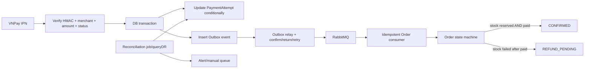

# Playbook phản biện và phương án xử lý

## 1. Luận điểm trung tâm

### Luận điểm nên dùng

> Eventual consistency chỉ chấp nhận được khi hệ thống có cơ chế để cuối cùng hội tụ về nguồn đúng. Hiện tại nguồn callback chưa được xác thực, event có thể mất ở dual-write gap, và consumer không có quy tắc chống duplicate/out-of-order. Vì thế một số trạng thái không tự hội tụ; chúng tồn tại vô thời hạn hoặc hội tụ về kết quả sai.

### Luận điểm không nên dùng

- “RabbitMQ đảm bảo không mất message.” Broker không thể lưu message chưa từng được publish thành công, và no-route message có thể bị drop.
- “Có `@Transactional` nên Payment DB và RabbitMQ cùng transaction.” Hai resource không nằm trong cùng local DB transaction.
- “Callback public là lỗ hổng.” IPN phải public/reachable; lỗ hổng là public nhưng không xác thực HMAC và dữ liệu nghiệp vụ.
- “Dùng microservice thì chấp nhận dữ liệu lệch.” Chỉ chấp nhận lệch tạm thời, có bound/SLA và tự hội tụ; không chấp nhận mất tiền hoặc terminal state bị đảo.
- “Set status là idempotent.” Chỉ idempotent khi cùng event, cùng state và không có side effect; code hiện cho phép state regression.

## 2. Hỏi–đáp phản biện

### Q1. “VNPay đã gửi `vnp_ResponseCode=00`, sao cần kiểm thêm?”

Vì query parameter do caller gửi tới endpoint public. Phải kiểm `vnp_SecureHash` để chứng minh dữ liệu không bị sửa và đến từ bên biết secret. Sau đó vẫn cần kiểm `vnp_TmnCode`, `vnp_TxnRef`, amount, trạng thái hiện tại và cả `vnp_TransactionStatus`. Tài liệu VNPay yêu cầu checksum là bước đầu tiên và ví dụ IPN kiểm order, amount, status trước khi update.

### Q2. “Đã ký URL lúc gửi sang VNPay rồi mà?”

Chữ ký request chỉ bảo vệ chiều merchant → VNPay. Callback là một HTTP request mới ở chiều ngược lại, chứa bộ tham số và chữ ký response riêng. Lưu chữ ký request ban đầu trong DB không xác minh callback.

### Q3. “Return URL và IPN cùng tham số, dùng chung một endpoint được không?”

Có thể tái sử dụng cùng hàm **validate/interpret** ở tầng service, nhưng vai trò HTTP khác nhau:

- Return URL phục vụ browser/UI và không nên là nguồn duy nhất cập nhật tiền.
- IPN phục vụ server-to-server, cập nhật idempotent và trả đúng `{RspCode, Message}` để VNPay biết có retry hay không.

Tách endpoint thường rõ hơn; quan trọng nhất là IPN không phụ thuộc browser.

### Q4. “Nếu frontend luôn gọi backend callback thì có ổn không?”

Không. Frontend/browser không phải kênh delivery đáng tin cậy và query vẫn phải được backend kiểm HMAC. Người dùng có thể đóng tab, mất mạng, chặn JavaScript hoặc request bị can thiệp. VNPay thiết kế IPN chính để giải quyết điều này.

### Q5. “`@TransactionalEventListener(AFTER_COMMIT)` đã giải quyết mất event chưa?”

Chưa. Nó bảo đảm chỉ thử publish sau khi Payment DB commit. Nếu process chết hoặc publish thất bại ngay sau commit, DB không rollback và không có durable record để thử lại. Transactional outbox lưu business update và outbox row trong cùng DB transaction, rồi worker mới publish/retry.

### Q6. “Bật publisher confirm là đủ, khỏi outbox?”

Không. Confirm cho biết broker đã nhận publish của **lần thử hiện tại**; nó không đóng crash window giữa DB commit và lúc app bắt đầu/gắn trạng thái publish. Outbox giữ ý định publish bền vững qua process crash. Confirm/return vẫn hữu ích cho outbox relay để biết khi nào được đánh dấu sent.

### Q7. “Có outbox rồi thì consumer không cần idempotent?”

Vẫn cần. Outbox relay có thể publish lại nếu broker nhận message nhưng confirm/DB update `sent` bị mất. RabbitMQ cũng mô tả duplicate là khả năng bình thường khi retry. Consumer cần `eventId` unique và state transition guard.

### Q8. “Duplicate COMPLETED thì set lại COMPLETED, có gì nguy hiểm?”

Nếu order vẫn bình thường thì set cùng giá trị gần như vô hại. Nhưng nếu giữa hai lần event order đã `CANCELLED` hoặc refund workflow bắt đầu, event cũ sẽ đặt lại `CONFIRMED`. Idempotency phải xét event identity, version và terminal states, không chỉ phép gán field.

### Q9. “Stock và payment đều có thể confirm order, nhanh hơn mà?”

Nhanh nhưng sai invariant. Với VNPAY, order chỉ được confirm khi **cả** stock reserved và payment completed. Hiện Order không lưu stock reservation state độc lập, nên payment consumer không biết stock đã fail hay chưa. Hai event cạnh tranh ghi một field không tạo ra phép AND; nó tạo last-writer-wins.

### Q10. “Nếu stock fail sau khi payment success, set CANCELLED là đủ?”

Không. Tiền đã thu là side effect bên ngoài. Phải tạo refund workflow thật và chỉ ghi `REFUNDED` khi VNPay xác nhận; trước đó là `REFUND_PENDING`/`REFUND_FAILED`. Đồng thời phải lưu request ID, response, retry và đối soát.

### Q11. “15 phút hết hạn link sẽ tự giải phóng stock chứ?”

Không có bằng chứng trong code. `vnp_ExpireDate` chỉ truyền sang VNPay. Không có scheduler nội bộ đọc payment/order quá hạn để queryDR, cancel và restore stock.

### Q12. “Một payment record cho mỗi order là đơn giản, có gì sai?”

Một order có thể có nhiều lần thử thanh toán. Ghi đè txnRef làm callback attempt cũ không còn đối tượng để match, mất audit trail và có thể reset `COMPLETED` về `PENDING`. Giữ nhiều attempt không phải over-engineering trong payment domain; đó là dữ liệu thực tế phát sinh.

### Q13. “Random 8 số đủ unique rồi?”

Không nên dựa vào xác suất khi DB có thể enforce. Ngoài collision, vấn đề chính là `transaction_id` không unique và attempt bị ghi đè. Merchant reference cần uniqueness theo yêu cầu VNPay và cần được persist bất biến.

### Q14. “Rabbit queue durable rồi thì không mất message?”

Durable queue giúp qua broker restart khi message persistent đã được route vào queue. Nó không giúp nếu queue/binding chưa tồn tại, publisher chưa được confirm, app crash trước publish, hoặc consumer xử lý sai rồi ack.

### Q15. “Hiện test tải callback 200 và Order đổi status, vậy đủ chưa?”

Đó là happy-path propagation test. Nó không kiểm signature, amount mismatch, duplicate, out-of-order, broker outage ở đúng crash window, no-route, service restart, abandoned checkout, nhiều attempt hay refund. Throughput/latency tốt không chứng minh correctness.

### Q16. “Có thể dùng distributed transaction/XA cho PostgreSQL và RabbitMQ không?”

Về lý thuyết có các cơ chế phối hợp transaction, nhưng không cần chọn con đường phức tạp đó. Với codebase này, transactional outbox là phương án chuẩn, dễ vận hành và giữ local transaction ngắn. Cần chấp nhận at-least-once và làm consumer idempotent.

### Q17. “QueryDR có thay thế IPN/outbox không?”

Không. QueryDR là safety net và công cụ reconciliation khi IPN thiếu/mơ hồ hoặc nội bộ lệch. IPN vẫn là đường cập nhật chính; outbox bảo đảm lan truyền nội bộ. Ba lớp giải quyết ba failure boundary khác nhau.

### Q18. “Nếu VNPay production đã cấu hình IPN ngoài repo thì đánh giá có còn đúng?”

Rủi ro mất browser redirect giảm. Nhưng cần kiểm endpoint IPN thực tế có xác minh checksum/amount/status và trả đúng response không. Nếu nó trỏ vào callback code hiện tại, các rủi ro integrity, dual-write, ordering và refund vẫn còn.

### Q19. “Tại sao gọi đây là Critical khi xác suất crash đúng vài mili giây thấp?”

Xác suất mỗi request nhỏ nhưng tích lũy theo số giao dịch và thời gian vận hành. Tác động tài chính/cam kết giao hàng cao, trạng thái không tự hồi phục, và có các đường xác suất cao hơn như user bỏ checkout, retry link hoặc event đảo thứ tự. Risk = probability × impact × detectability/recoverability.

### Q20. “Giải pháp nhỏ nhất đủ dùng là gì?”

Nếu mục tiêu là chặn tổn thất trước mắt:

1. Không cho callback chưa xác thực thay đổi DB.
2. Có IPN backend đúng chuẩn và chỉ transition từ `PENDING` bằng conditional update.
3. Không confirm order tới khi cả stock và payment đạt điều kiện.
4. Không ghi `REFUNDED` nếu chưa gọi/nhận kết quả refund.

Sau đó mới bảo đảm delivery bằng outbox và thêm reconciliation. Chỉ làm một phần không tạo production-grade payment flow, nhưng thứ tự này giảm rủi ro nhanh nhất.

## 3. Thiết kế mục tiêu tối thiểu



### Payment attempt state

Gợi ý tối thiểu:

```text
CREATED/PENDING
  ├─> COMPLETED       terminal cho thu tiền
  ├─> FAILED          terminal cho attempt này
  └─> EXPIRED         terminal cho attempt này

COMPLETED
  └─> REFUND_PENDING
        ├─> REFUNDED
        └─> REFUND_FAILED (retry/reconcile)
```

Không cho phép `COMPLETED -> FAILED/PENDING`. Nếu VNPay có trạng thái đảo/chargeback cần model riêng, không tái dùng `FAILED` mơ hồ.

### Order fulfillment state

Đừng dùng mỗi `orderStatus` để suy ra mọi thứ. Cần ít nhất:

```text
paymentStatus: PENDING | COMPLETED | FAILED | ...
stockStatus:   PENDING | RESERVED | FAILED | RELEASED
orderStatus:   PENDING | CONFIRMED | SHIPPED | DELIVERED | CANCELLED
```

Quy tắc:

```text
VNPAY order CONFIRMED iff paymentStatus=COMPLETED && stockStatus=RESERVED.
stockStatus=FAILED && paymentStatus=COMPLETED => cancel + refund workflow.
payment FAILED/EXPIRED && stock RESERVED => release stock + cancel.
```

## 4. Lộ trình sửa theo ưu tiên

### Phase 0 — xác minh production, không sửa code

- Lấy cấu hình IPN thực tế từ VNPay Merchant Portal.
- Xác nhận Return URL frontend xử lý gì.
- Kiểm tra RabbitMQ bindings/policies/DLX/quorum ngoài repo.
- Đối soát một mẫu giao dịch `PENDING`, `COMPLETED`, `CANCELLED`, `REFUNDED` giữa VNPay, Payment DB và Order DB.
- Kiểm tra log callback có request không chữ ký hoặc amount mismatch.

### Phase 1 — chặn sai tiền và sai trạng thái (P0)

- Tạo IPN endpoint server-to-server, SSL, đúng response `RspCode`/`Message`.
- Verify HMAC constant-time; reject thiếu/sai signature trước mọi DB mutation.
- Check `vnp_TmnCode`, txnRef, amount, response code và transaction status.
- Conditional transition `PENDING -> COMPLETED/FAILED`; duplicate trả idempotent response.
- Verify order ownership và eligibility khi tạo/đọc payment.
- Chặn create link khi order terminal hoặc đã paid.
- Sửa Order invariant: payment success không tự confirm nếu stock chưa `RESERVED`; không hồi sinh `CANCELLED`.

### Phase 2 — không mất thay đổi đã commit (P1)

- Thêm `payment_attempts`, không ghi đè transaction cũ.
- Thêm `outbox_events` trong Payment DB.
- Publish event có `eventId`, attemptId/txnRef, status, occurredAt/version.
- Relay dùng publisher confirms + mandatory returns + bounded retry/backoff.
- Consumer Order lưu processed event hoặc conditional version; duplicate là no-op.
- Thêm retry/DLQ rõ ràng cho poison messages và quy trình redrive.

### Phase 3 — compensation và self-healing (P1)

- Persist stock reservation state.
- Hết hạn payment: queryDR trước khi kết luận fail, sau đó release stock/cancel.
- Thực hiện VNPay refund API; model `REFUND_PENDING/REFUNDED/REFUND_FAILED`.
- Reconciliation job so sánh pending/ambiguous attempts với queryDR.
- Alert khi mismatch kéo dài quá SLA.

### Phase 4 — hardening/operations (P2)

- Metrics: callback invalid signature, amount mismatch, outbox age, retries, DLQ depth, payment-order lag, mismatch count.
- Audit log bất biến, redaction dữ liệu nhạy cảm.
- Chaos tests cho crash/network/broker outage.
- Dashboard và runbook đối soát/hoàn tiền.

## 5. Acceptance criteria có thể đưa vào ticket

### IPN

- Request thiếu/sai `vnp_SecureHash` không thay đổi bất kỳ DB nào.
- Amount mismatch trả mã lỗi phù hợp và không đổi status.
- Chỉ success khi cả `vnp_ResponseCode` và `vnp_TransactionStatus` thể hiện thành công theo đặc tả đang dùng.
- Duplicate IPN trả response ổn định, không phát side effect lần hai.
- IPN không phụ thuộc authentication của user/browser.

### Payment attempts

- Tạo link lần hai không xóa/ghi đè attempt lần một.
- Callback muộn của attempt A vẫn tìm được A.
- Một order không thể có hai attempt cùng trở thành winner `COMPLETED` mà không raise incident.
- `transaction_id`/merchant ref có unique constraint phù hợp.

### Messaging

- Crash sau payment commit nhưng trước publish không làm mất event; outbox relay phát sau restart.
- Unroutable event được phát hiện, không đánh dấu sent.
- Duplicate event không đổi state/side effect lần hai.
- Event cũ không thể ghi đè terminal/newer state.

### Order/stock/refund

- VNPAY order chỉ `CONFIRMED` khi paid + stock reserved, bất kể thứ tự event.
- Stock failure sau paid tạo refund workflow, không ghi `REFUNDED` sớm.
- Payment failure/expiry sau stock reservation release stock đúng một lần.
- Refund chỉ `REFUNDED` sau response/đối soát xác nhận từ VNPay.

## 6. Những đề xuất dễ nghe nhưng chưa đủ

| Đề xuất | Vì sao chưa đủ |
|---|---|
| Thêm retry vào `convertAndSend` | Crash trước retry vẫn mất; retry có thể duplicate |
| Gọi Order Service đồng bộ từ callback | Chuyển lỗi thành distributed dual-write; Order down làm callback fail sau Payment commit |
| Cho Payment DB rollback nếu Rabbit lỗi | Publish sau commit không rollback được; publish trước commit có chiều lỗi ngược |
| Dùng một queue durable | Không giải quyết no-route trước khi queue tồn tại, source callback và consumer logic |
| Chỉ kiểm `vnp_SecureHash` | Callback thật nhưng sai amount/order/state vẫn có thể gây lỗi nghiệp vụ |
| Chỉ thêm `@Version` | Phát hiện conflict nhưng vẫn cần retry + state machine |
| Chỉ thêm event timestamp | Đồng hồ không phải sequence đáng tin; cần aggregate version/conditional transition |
| Chỉ cron reset PENDING sau 15 phút | Có thể cancel giao dịch đã thu tiền nhưng IPN mất; phải queryDR trước |
| Ghi `REFUNDED` rồi xử lý sau | Báo cáo tài chính sai; dùng `REFUND_PENDING` |
| Giữ một row và thêm lịch sử log text | Không query/constraint/idempotency được theo từng attempt |

## 7. Câu chốt khi bị ép chọn consistency hay availability

Payment không cần làm mọi service strongly consistent trong một distributed transaction. Cần phân loại:

- **Money ledger và state transition**: ưu tiên correctness, durable write, idempotency.
- **Lan truyền sang Order**: cho phép eventual consistency có outbox/retry và SLA.
- **UI**: có thể hiển thị “đang xác nhận thanh toán” thay vì đoán success.
- **Fulfillment/refund**: chỉ chạy khi invariant đủ; nếu mơ hồ thì giữ trạng thái pending và query/reconcile.

Đây là lựa chọn “đúng trước, hội tụ sau”, không phải yêu cầu strong consistency cho toàn hệ thống.

## 8. Câu hỏi ngược lại cho người phản biện

Những câu này giúp đưa thảo luận về bằng chứng vận hành:

1. IPN production đang trỏ URL nào, handler code nằm đâu?
2. Khi Payment DB `COMPLETED` nhưng Order `PENDING`, cơ chế nào tự retry và SLA bao lâu?
3. Có dashboard/alert nào phát hiện mismatch này không?
4. Khi một callback đến hai lần hoặc đảo thứ tự, transition table nào quyết định event được chấp nhận?
5. Làm sao chứng minh `REFUNDED` tương ứng một refund transaction thật tại VNPay?
6. Payment attempt cũ được lưu ở đâu khi user tạo link lần hai?
7. Nếu queue chưa được declare, publisher phát hiện no-route bằng gì?
8. Nếu stock fail sau khi thu tiền, ai sở hữu compensation và retry đến bao giờ?
9. Pending 15 phút được queryDR hay bị cancel mù?
10. Bài test nào cố tình kill service giữa DB commit và publish?

Nếu chưa có câu trả lời cụ thể bằng code/config/metrics, rủi ro vẫn mở.
