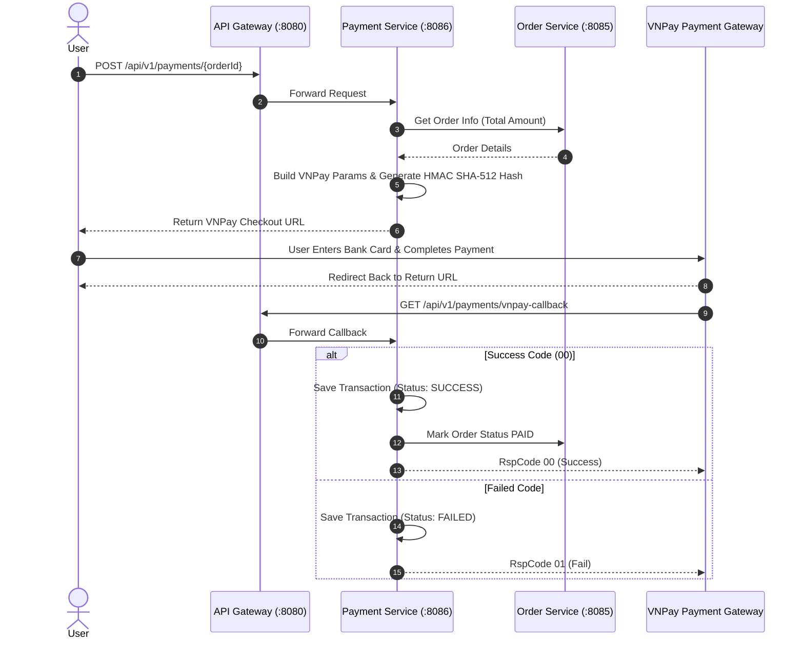

# 💳 Payment Service Documentation

> **Service Name**: `payment-service`  
> **Port**: `8086`  
> **Database**: PostgreSQL (`kyro_payment`)  
> **Integration**: Cổng Thanh Toán VNPay (Sandbox / Production), Order Client (Feign HTTP)  
> **Package**: `com.kyro`

---

## 📌 1. Chức Năng Chính

**Payment Service** tích hợp cổng thanh toán trực tuyến **VNPay**, sinh URL thanh toán an toàn và xử lý Webhook / IPN Callback từ ngân hàng:

1. **Tạo URL Thanh Toán VNPay (VNPay Payment URL Generation)**:
   - Gọi `OrderClient` lấy thông tin đơn hàng và số tiền cần thanh toán.
   - Tạo mã tham chiếu giao dịch duy nhất (`vnp_TxnRef`).
   - Tính toán chữ ký HMAC SHA-512 với `VNPAY_HASH_SECRET` để chống giả mạo thông số.
   - Trả về đường dẫn VNPay Checkout cho Frontend chuyển hướng người dùng.
2. **Xử Lý Callback**:
   - Tiếp nhận Callback từ VNPay khi người dùng hoàn tất thanh toán.
   - Cập nhật trạng thái giao dịch trong DB `kyro_payment` (`SUCCESS` / `FAILED`).
3. **Cập Nhật Trạng Thái Đơn Hàng**:
   - Khi thanh toán thành công, gọi `OrderClient` cập nhật `paymentStatus = PAID`.

---

## 🔐 2. Luồng Thanh Toán VNPay Sequence Diagram

---

## 📡 3. Danh Sách REST Endpoints Chính

| Method | Endpoint | Description | Permitted Roles |
| :--- | :--- | :--- | :--- |
| `POST` | `/api/v1/payments/{orderId}` | Tạo URL thanh toán VNPay cho đơn hàng | User / Admin |
| `GET` | `/api/v1/payments/vnpay-callback` | Callback nhận kết quả từ VNPay | Public |
| `GET` | `/api/v1/payments/orders/{orderId}` | Tra cứu thanh toán của đơn hàng | User / Admin |
